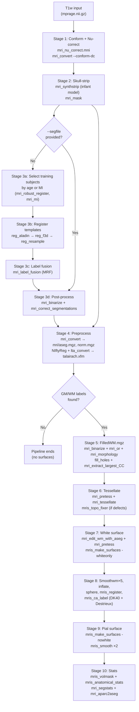

# infant_recon_all

## Overview

`infant_recon_all` is FreeSurfer's automated processing pipeline for T1-weighted
brain MRI of infants aged **0–4.5 years** (T2 processing is not yet implemented).
It produces a volumetric segmentation of cortical and subcortical structures,
cortical surfaces (white and pial), and morphometric statistics, using a strategy
fundamentally different from the adult [[wiki/pipelines/recon-all|recon-all]] pipeline:

- **No Gaussian Classifier Atlas (GCA).** Segmentation uses a k-NN label fusion
  over a curated set of 29 manually labelled training subjects (the CNYBCH atlas).
- **NIftyReg registration.** Template-to-subject registration uses NIftyReg
  (`reg_aladin` affine + `reg_f3d` B-spline non-rigid) rather than FreeSurfer's
  own GCA morph.
- **MRF label fusion.** Warped segmentations are fused with `mri_label_fusion`
  using a Markov Random Field (MRF) smoothness prior, bias-field correction, and
  Gaussian intensity models.
- **Patch-based topology correction.** `mris_topo_fixer` is used instead of the
  sphere-based `mris_fix_topology`.
- **Infant skull-stripping model.** A dedicated PyTorch SynthStrip model updated
  January 2025 replaces the generic adult model.

**References:**
- Zöllei L, Iglesias JE, Ou Y, Grant PE, Fischl B. *Infant FreeSurfer: An automated
  segmentation and surface extraction pipeline for T1-weighted neuroimaging data of
  infants 0–2 years.* NeuroImage, 2020, 116946.
- Kelley W et al. *Boosting skull-stripping performance for pediatric brain images.*
  Proc IEEE Int Symp Biomed Imaging. 2024; doi: 10.1109/isbi56570.2024.10635307.

---

## Prerequisites

| Requirement | Detail |
|-------------|--------|
| `FREESURFER_HOME` | Must be set; pipeline locates atlas and models from it |
| `SUBJECTS_DIR` | Must be set, or `--outdir` must be provided |
| Input file | T1-weighted NIfTI (`.nii.gz`); or pre-masked image (`--masked`); or pre-computed mask (`--mask`). Default location: `$SUBJECTS_DIR/<subject>/mprage.nii.gz` |
| Age | Required (months) for the default template-selection mode; omissible with `--newborn`/`--oneyear` or when providing `--segfile` |
| FSL | Required if `--intnormFSL` is used; otherwise optional |
| NIftyReg | Bundled in `$FREESURFER_HOME/bin/` — `reg_aladin`, `reg_f3d`, `reg_resample` |
| surfa, PyTorch, TensorFlow | Python dependencies (see `python/requirements-infant.txt`) |
| `$FREESURFER_HOME/average/CNYBCH/` | 29 template subjects; installed with FreeSurfer |
| `$FREESURFER_HOME/average/synthstrip_skullstripping/infant_synthstrip_01012025.pt` | Skull-stripping model (~31 MB PyTorch) |

---

## Configuration Options

| Flag | Type | Default | Description |
|------|------|---------|-------------|
| `-s`/`--s` | string | required | Subject name; output goes to `$SUBJECTS_DIR/<subject>/` (or `--outdir`) |
| `-i`/`--inputfile` | path | `$SUBJECTS_DIR/<subject>/mprage.nii.gz` | T1 input image; must be NIfTI (`.nii.gz`) or convertible via `mri_convert` |
| `-o`/`--outdir` | path | `$SUBJECTS_DIR/<subject>` | Output directory; if set, `SUBJECTS_DIR` is temporarily overridden to its parent |
| `--age` | int (months) | required unless `--newborn`, `--oneyear`, or `--segfile` | Age in months; used by the default age-proximity k-NN template selector |
| `--masked` | path | — | Pre-skull-stripped and pre-normalised image; **skips both nu-correction and skull-stripping** — the image is conformed directly to `mri/norm.nii.gz` without any intensity processing |
| `--mask` | path | — | Pre-computed binary brain mask; nu-correction and conform still run on the raw input, then this mask is applied in place of SynthStrip output |
| `--segfile` | path | — | Pre-computed volumetric segmentation; skips the entire label-fusion stage. Requires `--masked` (or `--forceskullstrip`) so that a skull-stripped image exists for surface creation; must have the same voxel dimensions as `--masked` |
| `--newborn` | bool | off | Use all 5 Neonates group templates (ages 0–4 months); makes `--age` optional; mutually exclusive with `--oneyear` |
| `--oneyear` | bool | off | Use all 5 AroundOne group templates (ages 10–14 months); makes `--age` optional; mutually exclusive with `--newborn` |
| `--avoidtraining` | string | — | Exclude exactly one named training subject from the k-NN pool (single `.pop()` call — only one subject can be excluded per run) |
| `--kneigh` | int | 4 | Number of training subjects for label fusion; when used with `--newborn` or `--oneyear`, **implicitly enables MI-based selection** from the preset group (regardless of `--MI`) |
| `--MI` | bool | off | Select training subjects by mutual information rather than age proximity; registers every candidate template with `mri_robust_register --affine --satit`, computes MI with `mri_mi`, picks the top `--kneigh` scorers; scores written to `log/template_mi_scores.yaml` |
| `--gmwm` | bool | off | After segmentation, abort before surface creation if labels 2 (LH WM) and 41 (RH WM) are both absent from the final `aseg.nii.gz`; prints "Skipping surface creation". **Does not control training subject selection** — the one-GMWM-subject guarantee in the k-NN pool is always active (`enforce_gm_wm_template_subj = True` hardcoded) |
| `--ccseg` | bool | off | Run `mri_cc` after segmentation to add corpus callosum labels to `aseg` (writes `mri/aseg_CCseg.mgz`; the standard `mri/aseg.mgz` is not replaced) |
| `--no-stats` | bool | off | Skip Stage 10 entirely: ribbon, `mris_anatomical_stats`, `mri_segstats`, eTIV, and `mri_aparc2aseg` are all omitted |
| `--intnormFSL` | bool | off | Use FSL `fslmaths -div <max> -mul 255 -odt char` for intensity normalisation instead of `mri_nu_correct.mni --n 2`; requires FSL on `$PATH` |
| `--model` | path | `$FREESURFER_HOME/average/synthstrip_skullstripping/infant_synthstrip_01012025.pt` | PyTorch weights for the infant SynthStrip skull-stripping model; model file must exist unless `--masked` is provided |
| `--forceskullstrip` | bool | off | Run skull-stripping even when `--segfile` is provided (normally `--segfile` implies the brain is already stripped); mutually exclusive with `--masked` |
| `--keep-going` | bool | off | Resume a previously interrupted run; the surfa `CommandPipeline` checks output file existence to decide which stages to skip. **Must be run with identical original arguments** or stages will be incorrectly skipped |
| `--force` | bool | off | Suppress the "output already exists" fatal error and proceed; does not force individual pipeline stages to re-run if their outputs already exist |
| `--no-cleanup` | bool | off | Retain the `work/` temporary directory after completion; requires ≥2 GB free space |
| `--checkresults` | bool | off | Open `freeview` interactively at two checkpoints: after skull-stripping (to inspect `mri/norm.nii.gz`) and after segmentation |
| `--t2` | bool | off | (**NOT YET IMPLEMENTED** — parsed but no code path exists) |
| `--t2file` | path | — | (**NOT YET IMPLEMENTED** — parsed and validated against `--t2`, but unused) |

> [!gotcha] `--masked` skips nu-correction as well as skull-stripping
> When `--masked` is provided the entire preprocessing `else` branch is bypassed:
> `mri_nu_correct.mni`, `mri_convert --conform-dc`, and `mri_synthstrip` are all
> skipped. The provided file is conformed once with `mri_convert --conform-dc` and
> written directly to `mri/norm.nii.gz`. Pass a volume that is already bias-field
> corrected if intensity quality matters for surface placement.

> [!gotcha] `--gmwm` controls a post-segmentation abort check, not subject selection
> The one-GMWM-subject guarantee (`enforce_gm_wm_template_subj = True`) is
> **unconditional** — it applies whether or not `--gmwm` is set. What `--gmwm`
> actually does is enable an additional check after label fusion: if the fused
> segmentation contains neither label 2 nor label 41, the pipeline prints
> "Skipping surface creation as no GM/WM separation in the segmentation!" and
> calls `pl.done()`, halting before Stage 5.

> [!gotcha] `--kneigh` with `--newborn`/`--oneyear` silently activates MI selection
> In default mode, `--MI` explicitly opts into mutual-information-based template
> selection. But when `--newborn` or `--oneyear` is used together with `--kneigh`,
> `find_neighbors_by_mi()` is called unconditionally (line 340), regardless of
> whether `--MI` was passed. Using `--kneigh 3 --newborn` therefore runs full
> affine registration of all Neonates templates to the subject as a side effect.

> [!gotcha] `--avoidtraining` only removes a single subject
> The argument is handled by a single `.pop(args.avoidtraining, None)` call on
> both the main pool and the GMWM pool. Only one subject name can be excluded;
> to exclude multiple, the script must be run with wrapper logic.

> [!gotcha] `--keep-going` requires identical original arguments
> The surfa `CommandPipeline` tracks completed stages by checking output file
> existence. If original flags are changed between runs, stages with existing
> outputs will be silently skipped even if the change would affect them.

> [!gotcha] `--force` does not force individual stage re-runs
> `--force` suppresses the upfront "mri/ directory already exists" fatal error,
> but each stage is still gated on whether its declared outputs already exist.
> To genuinely rerun a stage, delete its output files before invoking with
> `--keep-going`, or delete the entire output directory and use `--force`.

> [!gotcha] GPU support is disabled
> `--usegpu` and `--gpuid` flags exist in comments in the source
> (`# temporarily removed while testing if we need the GPU`) but are not exposed
> in the argparse. Skull-stripping always runs on CPU.

> [!gotcha] Output directory vs `SUBJECTS_DIR`
> When `--outdir` is specified, the pipeline sets `SUBJECTS_DIR` to the parent of
> `--outdir` before calling the surface scripts. This is wrapped in `try/except`
> so that `SUBJECTS_DIR` is restored on failure, but tools called during the
> surface stages that rely on `SUBJECTS_DIR` will see the overridden value.

---

## Processing Stages

### Stage 1: Input handling and intensity normalization

**Tool:** [[wiki/tools/mri_convert|mri_convert]], [[mri_nu_correct.mni]] (or FSL `fslmaths`)

**Commands:**
```
# Convert non-NIfTI input
mri_convert <inputfile> mprage.nii.gz

# Intensity normalization (default: N3 bias correction, 2 iterations)
mri_nu_correct.mni --i mprage.nii.gz --o work/mprage.nu.nii.gz --n 2

# FSL alternative (--intnormFSL)
fslmaths mprage.nii.gz -div `fslstats mprage.nii.gz -R | awk '{print $2}'` -mul 255 work/mprage.nu.nii.gz -odt char

# Conform to isotropic resolution with DC correction
mri_convert --conform-dc work/mprage.nu.nii.gz work/mprage.nu.conf.nii.gz
```

**Inputs:** Raw T1 (`mprage.nii.gz`)
**Outputs:** `work/mprage.nu.conf.nii.gz`

**Notes:**
- Skipped entirely when `--masked` is provided (the masked image is conformed
  directly to `mri/norm.nii.gz`).

---

### Stage 2: Skull-stripping

**Tool:** [[mri_synthstrip]], [[mri_mask]]

**Commands:**
```
mri_synthstrip -i work/mprage.nu.conf.nii.gz \
               -o work/synthstrip/synthstrip_skullstrip.nii.gz \
               --model $FSHOME/average/synthstrip_skullstripping/infant_synthstrip_01012025.pt

mri_mask work/mprage.nu.conf.nii.gz \
         work/synthstrip/synthstrip_skullstrip.nii.gz \
         mri/norm.nii.gz
```

**Inputs:** `work/mprage.nu.conf.nii.gz`
**Outputs:** `mri/norm.nii.gz` (skull-stripped, bias-corrected, conformed)

**Notes:**
- Skipped when `--masked` or `--mask` is provided.
- The infant model (`infant_synthstrip_01012025.pt`, updated 2025-01-01) is
  distinct from the adult SynthStrip model.
- When `--mask` is provided, `mri_mask` is called directly with the user's mask
  instead of the SynthStrip output.

---

### Stage 3: Segmentation via k-NN label fusion

**Tools:** [[mri_robust_register]], [[mri_mi]], NIftyReg (`reg_aladin`, `reg_f3d`,
`reg_resample`), `mri_label_fusion`, [[mri_binarize]], `mri_correct_segmentations`

**Skipped if:** `--segfile` is provided (stage converts the provided segmentation
with `mri_convert --conform-dc ... -rt nearest --no_scale 1`).

#### 3a. Training subject selection

The pool of training subjects is loaded from
`$FREESURFER_HOME/average/CNYBCH.yaml`, which contains four groups:

| Group | Members | Ages (months) |
|-------|---------|---------------|
| `All` | 29 subjects (Template1–Template29) | 0–56 |
| `GMWM` | 12 subjects with separate GM/WM labels | mixed |
| `Neonates` | 5 subjects | 0–4 |
| `AroundOne` | 5 subjects | 10–14 |

**Default mode (`--age N`):** selects `k` nearest neighbours by age from the
`All` group using a heap sort on `|age_template − age_subject|`. If `--gmwm` is
set (default `enforce_gm_wm_template_subj = True` in source), the nearest GMWM
subject is guaranteed to be included, replacing the last neighbour if necessary.

**`--MI` mode:** registers each template to the subject with
`mri_robust_register --affine --satit`, then computes MI with [[mri_mi]], and
selects the `k` highest-MI templates. MI scores are written to
`log/template_mi_scores.yaml`.

**`--newborn`/`--oneyear`:** uses the entire `Neonates` or `AroundOne` group
(all 5 subjects) regardless of `--kneigh`.

> [!gotcha] Subject excluded from its own training pool
> If the subject being processed (`-s`) has the same name as a training template
> in CNYBCH.yaml, it is silently removed from the pool. This is intentional for
> cross-validation but means you will get k−1 templates if processing a template
> subject.

#### 3b. Affine + non-linear registration per template

For each selected template subject `ts`:
```
reg_aladin -ref mri/norm.nii.gz \
           -flo $FSHOME/average/CNYBCH/<ts>/norm.nii.gz \
           -aff work/<ts>-2-<subj>.niftyreg.affine.txt \
           -res work/<ts>-2-<subj>.niftyreg.affine.nii.gz \
           -voff -pad 0

reg_f3d   -ref mri/norm.nii.gz \
          -flo $FSHOME/average/CNYBCH/<ts>/norm.nii.gz \
          -aff work/<ts>-2-<subj>.niftyreg.affine.txt \
          -cpp work/<ts>-2-<subj>.niftyreg.field.nii.gz \
          -res work/<ts>-2-<subj>.niftyreg.nii.gz \
          -pad 0

reg_resample -ref mri/norm.nii.gz \
             -flo $FSHOME/average/CNYBCH/<ts>/manualseg.nii.gz \
             -trans work/<ts>-2-<subj>.niftyreg.field.nii.gz \
             -res work/<ts>-2-<subj>.niftyreg.manseg.nii.gz \
             -inter 0 -pad 0
```

**Inputs per template:** `norm.nii.gz`, `manualseg.nii.gz` from the CNYBCH
training atlas
**Outputs per template:** affine text file, deformation field, warped segmentation

#### 3c. MRF label fusion

```
mri_label_fusion -i mri/norm.nii.gz \
                 -s <moved_seg_1> ... <moved_seg_k> \
                 -o work/labels.mrf.nii.gz \
                 --verbose --smooth \
                 --rho <0.5 + k*0.05> --beta 0.3 \
                 --bf-order 4 --max-lab 3 --unary-weight 5 \
                 -e 2 41 -e 3 42 \
                 -e 7 46 -e 8 47 \
                 -e 12 51 -e 13 52
```

Key parameters:
- `--rho` scales with the number of templates: $\rho = 0.5 + k \times 0.05$ (e.g.
  0.70 for k=4).
- `-e` flags enforce bilateral symmetry for cerebral WM (2↔41), cortical GM
  (3↔42), cerebellar WM (7↔46), cerebellar GM (8↔47), and basal ganglia
  (12↔51, 13↔52).

> [!gotcha] `mri_label_fusion` is an infant-specific tool
> `mri_label_fusion` (`infant/mri_label_fusion`) is a Python script bundled
> **separately** from the main FreeSurfer label-fusion tools. It implements
> Parzen-window posterior estimation with an MRF spatial prior and polynomial
> bias-field correction. It is not the same as `mri_fuse_segmentations` or
> the GCA-based `mri_ca_label`.

#### 3d. Post-processing

```
# Recode thalamus labels (48→49, 9→10) to match FreeSurfer standard LUT
mri_binarize --i work/labels.mrf.nii.gz \
             --replace 48 49 --replace 9 10 \
             --o work/recoded.nii.gz

# Multi-pass correction for biologically implausible configurations
mri_correct_segmentations work/recoded.nii.gz mri/aseg.nii.gz
# If no GM/WM in segmentation (labels 2 and 41 absent), adds -n flag
```

**Final segmentation:** `mri/aseg.nii.gz`

---

### Stage 4: Preprocess for surface stream

**Tools:** [[wiki/tools/mri_convert|mri_convert]], NIftyReg `reg_aladin`, [[lta_convert]], [[mri_cc]]

```
# Convert segmentation and normalized image to MGZ for surface tools
mri_convert mri/norm.nii.gz  mri/norm.mgz
mri_convert mri/aseg.nii.gz  mri/aseg.mgz

# Aliases expected by surface tools
cp mri/norm.mgz mri/brain.mgz
cp mri/norm.mgz mri/brainmask.mgz

# Talairach (MNI305) affine registration via NIftyReg
mri_convert $FSHOME/average/mni305.cor.mgz work/mni305.cor.nii.gz
reg_aladin -ref work/mni305.cor.nii.gz \
           -flo mri/norm.nii.gz \
           -res work/talairach.nii.gz \
           -aff work/talairach.txt -voff -pad 0
lta_convert --inniftyreg work/talairach.txt \
            --outmni mri/transforms/talairach.xfm \
            --src mri/norm.nii.gz --trg work/mni305.cor.nii.gz
cp mri/transforms/talairach.xfm mri/transforms/talairach.auto.xfm

# Optional corpus callosum segmentation (--ccseg)
mri_cc -sdir <output_subdir> -aseg aseg.mgz -o aseg_CCseg.mgz <subject>
```

**Outputs:** `mri/norm.mgz`, `mri/aseg.mgz`, `mri/brain.mgz`,
`mri/brainmask.mgz`, `mri/transforms/talairach.xfm`

> [!gotcha] Talairach registration uses NIftyReg, not `talairach_avi`
> Unlike the adult pipeline, the infant pipeline registers to MNI305 using
> `reg_aladin` (rigid/affine NIftyReg) and converts the result to `.xfm` format
> via `lta_convert --inniftyreg`. The resulting `talairach.xfm` is an affine
> transform only (no non-linear warp), and it cannot be applied directly to
> surfaces — see [[coordinate-systems]].

> [!gotcha] Pipeline halts if no GM/WM in segmentation
> If `--gmwm` was set and the final `aseg.nii.gz` contains neither label 2 (LH WM)
> nor label 41 (RH WM), the pipeline prints "Skipping surface creation" and exits
> before Stage 5. Surfaces are not built for such subjects.

---

### Stage 5: WM hemisphere mask construction

**Script:** `create_wm_surfaces_mprage_subject.csh`
**Tools:** [[mri_binarize]], [[mri_or]], `mri_morphology`, `mri_extract_largest_CC`

This stage builds `work/FilledWM.mgz`, a two-valued volume encoding the two
WM hemispheres: **LH = 255**, **RH = 127**. These non-standard values are used
as the tessellation target labels.

```
# 1. Extract per-hemisphere WM constituent labels
#    LH labels: 2 (WM), 9 (thalamus), 10 (caudate), 11 (putamen),
#               12 (pallidum), 13 (amygdala?), 25 (stem?), 26, 28, 30
#    RH labels: 41, 48, 49, 50, 51, 52, 57, 58, 60, 62

mri_binarize --i aseg.nii.gz --o work/<label>.mgz \
             --min <label> --max <label> --binval <255 or 127>
mri_or <label1.mgz> ... <labelN.mgz> work/WM.left.mgz

# 2. Fill ventricles into the WM mask (labels 4/43)
mri_or work/WM.left.255.mgz work/<lh_ventricle.mgz> work/WM.left.vfilled.mgz

# 3. Morphological hole filling (26-connected)
mri_morphology work/WM.<hemi>.vfilled.mgz fill_holes 26 work/WM.<hemi>.filled.mgz

# 4. Retain only largest connected component
mri_extract_largest_CC -hemi <lh|rh> -T 1 work/WM.<hemi>.filled.mgz \
                       work/WM.<hemi>.filled.CC.mgz

# 5. Merge both hemispheres
mri_or work/WM.right.127.filled.CC.mgz work/WM.left.255.filled.CC.mgz \
       work/FilledWM.mgz

# 6. Morphological closing (radius 1)
mri_morphology work/FilledWM.mgz close 1 work/FilledWM.mgz
```

**Output:** `work/FilledWM.mgz`

> [!gotcha] LH and RH use non-standard fill values
> Unlike the adult pipeline (`mri_fill` which uses 255 for both hemispheres
> distinguished by topology), the infant pipeline labels LH=255 and RH=127.
> These values are hard-coded and must match the subsequent `mri_pretess` and
> `mri_tessellate` calls.

---

### Stage 6: Surface tessellation and topology correction

**Tools:** [[mri_pretess]], [[mri_tessellate]], `mris_extract_main_component`,
[[mris_smooth]], [[mris_inflate]], [[mris_sphere]], [[mris_euler_number]],
[[mris_topo_fixer]], [[mris_remove_intersection]]

```
# Per hemisphere (hemi in lh, rh); label is 255 (LH) or 127 (RH)
mri_pretess work/FilledWM.mgz <label> mri/norm.mgz \
            work/FilledWM-pretess<label>.mgz
mri_tessellate work/FilledWM-pretess<label>.mgz <label> \
               work/surf/<hemi>.orig.nofix

mris_extract_main_component work/surf/<hemi>.orig.nofix \
                            work/surf/<hemi>.orig.nofix

mris_smooth -nw work/surf/<hemi>.orig.nofix work/surf/<hemi>.smoothorig.nofix
mris_inflate -no-save-sulc work/surf/<hemi>.smoothorig.nofix \
             work/surf/<hemi>.inflated.nofix
mris_sphere -q -in 3000 work/surf/<hemi>.inflated.nofix \
            work/surf/<hemi>.qsphere.nofix

# Topology check and conditional fix
mris_euler_number <hemi>.orig > <hemi>.orig.euler.txt
# If defect_index > 0:
mris_topo_fixer -mgz -warnings <subject> <hemi>
# else: cp <hemi>.orig <hemi>.orig_corrected

# Remove self-intersections
mris_remove_intersection surf/<hemi>.orig surf/<hemi>.orig
```

**Note:** `mris_topo_fixer` (patch-based) is used here, **not** `mris_fix_topology`
(sphere-based). This is intentional for infant data where the simpler patch
approach is preferred due to the different folding topology of immature cortex.

---

### Stage 7: WM volume and white surface placement

**Tools:** [[mri_binarize]], [[mri_edit_wm_with_aseg]], [[mri_pretess]],
[[mri_mask]], [[mris_make_surfaces]]

```
# Build wm.mgz (value 110 to match GCA expectation)
mri_or <rh_WM.41.mgz> <lh_WM.2.mgz> [<brainstem_labels.mgz>] \
       work/wm.nonscaled.mgz
mri_binarize --i work/wm.nonscaled.mgz --o work/wm.mgz \
             --min 1 --max 1 --binval 110
mri_convert --no_scale 1 --out_data_type uchar work/wm.mgz work/wm.uchar.mgz
mri_edit_wm_with_aseg work/wm.uchar.mgz mri/brain.mgz mri/aseg.nii.gz \
                      work/wm.asegedit.mgz
mri_pretess work/wm.asegedit.mgz wm mri/norm.mgz mri/wm.mgz

# Brain mask for surface placement
mri_mask -T 5 mri/brain.mgz mri/brainmask.mgz mri/brain.finalsurfs.mgz

# White surface placement (soap-bubble initialization, cover_seg constraint)
mris_make_surfaces -output .dist -soap -orig_white orig -aseg aseg \
                   -cover_seg mri/aseg.nii.gz -noaparc -whiteonly \
                   -mgz -T1 brain.finalsurfs <subject> <hemi>
mv surf/<hemi>.white.dist surf/<hemi>.white
mv surf/<hemi>.curv.dist  surf/<hemi>.curv
mv surf/<hemi>.area.dist  surf/<hemi>.area
mv label/<hemi>.cortex.dist.label label/<hemi>.cortex.label
```

**Key surface placement differences from adult recon-all:**
- `-cover_seg mri/aseg.nii.gz` constrains WM surface placement to stay inside the
  aseg segmentation boundary.
- `-soap` uses a soap-bubble initialization instead of the standard smoothing.
- No atlas-based intensity statistics (`-noauto` equivalently — the GCA is not used).

---

### Stage 8: Smoothwm, inflation, sphere, and cortical parcellation

**Tools:** [[mris_smooth]], [[mris_inflate]], [[mris_curvature]], [[mris_sphere]],
[[mris_register]], [[mris_ca_label]]

```
# Iterative smoothing (5 passes, each: -n 3 -nbrs 1 -gt .995 -d 2 -nw)
for i in 1..5:
    mris_smooth -n 3 -nbrs 1 -gt .995 -d 2 -nw \
                surf/<hemi>.smoothwm<i> surf/<hemi>.smoothwm<i+1>
cp surf/<hemi>.smoothwm5 surf/<hemi>.white

mris_smooth -n 3 -nw surf/<hemi>.white surf/<hemi>.smoothwm

# Inflation and curvature
mris_inflate surf/<hemi>.smoothwm surf/<hemi>.inflated
mris_curvature -thresh .999 -n -a 5 -w -distances 10 10 surf/<hemi>.inflated

# Spherical parameterization
mris_sphere surf/<hemi>.inflated surf/<hemi>.sphere

# Spherical registration to adult fsaverage atlas
mris_register -curv surf/<hemi>.sphere \
  $FSHOME/average/<hemi>.average.curvature.filled.buckner40.tif \
  surf/<hemi>.sphere.reg

# Cortical parcellation (Desikan-Killiany DK40 + Destrieux a2009s)
mris_ca_label -l label/<hemi>.cortex.label -aseg mri/aseg.mgz \
              <subject> <hemi> <hemi>.sphere.reg \
              $FSHOME/average/<hemi>.curvature.buckner40.filled.desikan_killiany.2010-03-25.gcs \
              <hemi>.aparc.annot

mris_ca_label -l label/<hemi>.cortex.label -aseg mri/aseg.mgz \
              <subject> <hemi> <hemi>.sphere.reg \
              $FSHOME/average/<hemi>.destrieux.simple.2009-07-29.gcs \
              <hemi>.aparc.a2009s.annot
```

> [!gotcha] White surface is smoothed 5× before final placement
> The infant pipeline performs five `mris_smooth` passes on the initial white
> surface and replaces `surf/<hemi>.white` with the result. This aggressive
> smoothing compensates for noisier initial surfaces in infant data. The adult
> pipeline applies 2 smoothwm passes (not overwriting white).

> [!gotcha] Atlas registration uses the adult Buckner40 atlas
> Despite being an infant pipeline, `mris_register` uses the adult
> `buckner40.tif` curvature atlas and DK40/Destrieux `.gcs` classifiers from the
> adult atlas. This is a known approximation; infant-specific atlases are not yet
> bundled.

---

### Stage 9: Pial surface placement

**Script:** `create_pial_surfaces_mprage_subject.csh`
**Tool:** [[mris_make_surfaces]], [[mris_smooth]]

```
# Pial surface (gradient-driven, partial-volume offset)
mris_make_surfaces -grad_dir 1 -intensity .3 -output .tmp \
                   -pial_offset .25 -nowhite -noaparc \
                   -cover_seg mri/aseg.nii.gz -orig_pial white \
                   <subject> <hemi>

# Post-smooth pial (2 iterations)
mris_smooth -nw -n 2 surf/<hemi>.pial.tmp surf/<hemi>.sm.pial.tmp
mv surf/<hemi>.sm.pial.tmp  surf/<hemi>.pial
mv surf/<hemi>.thickness.tmp surf/<hemi>.thickness
```

**Note:** `-pial_offset 0.25` shifts the pial surface outward by 0.25 mm relative
to the gradient zero-crossing, compensating for the poor GM/CSF contrast typical
of infant T1 images.

---

### Stage 10: Statistics

**Tools:** `mris_volmask`, [[mris_anatomical_stats]], [[mri_segstats]],
[[mri_aparc2aseg]]

Skipped if `--no-stats` is set.

```
# Cortical ribbon
mris_volmask --label_left_white 2 --label_left_ribbon 3 \
             --label_right_white 41 --label_right_ribbon 42 \
             --save_ribbon --save_distance <subject>
# Outputs: mri/ribbon.mgz, mri/lh.ribbon.mgz, mri/rh.ribbon.mgz

# Per-hemi morphometric stats (Desikan parcellation)
cp mri/aseg.mgz mri/aseg.presurf.mgz
mris_anatomical_stats -th3 -mgz -f stats/<hemi>.aparc.stats \
                      -b -a aparc.annot \
                      -c label/aparc.annot.ctab <subject> <hemi>

# Subcortical volume stats
mri_segstats --seg mri/aseg.mgz --sum stats/aseg.stats \
             --pv mri/norm.mgz --empty --brainmask mri/brainmask.mgz \
             --brain-vol-from-seg --excludeid 0 --excl-ctxgmwm \
             --supratent --subcortgray --in mri/norm.mgz \
             --in-intensity-name norm --in-intensity-units MR \
             --surf-wm-vol --surf-ctx-vol --totalgray \
             --ctab $FREESURFER_HOME/ASegStatsLUT.txt --subject <subject>
             [--etiv]   # added for subjects >= 12 months

# eTIV for infants < 12 months (dedicated registration path)
reg_aladin -ref $FSHOME/average/all_c_robtemplate_affine_mean.05.01.2018.nii.gz \
           -flo mri/norm.nii.gz \
           -aff mri/transforms/subj_2_common.txt \
           -res mri/transforms/subj_2_common.nii.gz -voff -pad 0
lta_convert --inniftyreg mri/transforms/subj_2_common.txt \
            --outlta mri/transforms/subj_2_common.lta \
            --outmni mri/transforms/subj_2_common.xfm \
            --src mri/norm.nii.gz \
            --trg $FSHOME/average/all_c_robtemplate_affine_mean.05.01.2018.nii.gz
lta_diff mri/transforms/subj_2_common.lta --dist 5 >> mri/transforms/det.txt
# eTIV = last_line_of_det.txt * 400321.078176

# Parcellation + aseg combined volume
mri_aparc2aseg --s <subject> --new-ribbon
```

> [!gap] eTIV multiplier constant
> The constant `400321.078176` multiplied against the registration determinant
> to estimate total intracranial volume is hardcoded at line 549. Its derivation
> (presumably the volume of the reference template in mm³ divided by some
> normalization factor) is not documented in the source or the existing
> literature. The reference template is
> `all_c_robtemplate_affine_mean.05.01.2018.nii.gz`.

---

## Data Flow Diagram



---

## Output Directory Structure

```
<subject>/
├── log/
│   ├── recon.log                  ← surfa CommandPipeline log
│   └── template_mi_scores.yaml    ← (--MI mode only)
├── mri/
│   ├── norm.nii.gz / norm.mgz     ← skull-stripped, bias-corrected input
│   ├── aseg.nii.gz / aseg.mgz     ← volumetric segmentation
│   ├── brain.mgz                  ← copy of norm.mgz
│   ├── brainmask.mgz              ← copy of norm.mgz
│   ├── wm.mgz                     ← WM mask (value 110)
│   ├── filled.mgz                 ← FilledWM.mgz (LH=255, RH=127)
│   ├── brain.finalsurfs.mgz       ← brain.mgz masked at threshold 5
│   ├── ribbon.mgz                 ← cortical ribbon label volume
│   ├── lh.ribbon.mgz, rh.ribbon.mgz
│   ├── aparc+aseg.mgz             ← parcellation fused with aseg
│   ├── aseg.presurf.mgz           ← copy of aseg before stats
│   └── transforms/
│       ├── talairach.xfm          ← NIftyReg-derived MNI305 affine
│       ├── talairach.auto.xfm     ← copy
│       └── subj_2_common.*        ← (age < 12 months) eTIV registration files
├── surf/
│   ├── ?h.orig                    ← post-topology-fix tessellation
│   ├── ?h.white                   ← final white surface (5× smoothed)
│   ├── ?h.smoothwm                ← smoothed white (1 pass, for inflate input)
│   ├── ?h.inflated                ← inflated surface
│   ├── ?h.sphere                  ← spherical map
│   ├── ?h.sphere.reg              ← registered to Buckner40
│   ├── ?h.pial                    ← pial surface
│   ├── ?h.curv, ?h.area           ← per-vertex curvature and area
│   ├── ?h.sulc                    ← sulcal depth (from mris_inflate)
│   └── ?h.thickness               ← cortical thickness
├── label/
│   ├── ?h.cortex.label            ← cortex label mask
│   ├── ?h.aparc.annot             ← DK40 parcellation
│   └── ?h.aparc.a2009s.annot      ← Destrieux parcellation
└── stats/
    ├── aseg.stats                 ← subcortical volumes
    ├── ?h.aparc.stats             ← per-hemi morphometrics
    └── eTIV.txt                   ← (age < 12 months) estimated TIV
```

---

## Differences from Adult `recon-all`

| Aspect | `recon-all` (adult) | `infant_recon_all` |
|--------|---------------------|-------------------|
| Segmentation method | GCA MAP labeling with GCA atlas | k-NN MRF label fusion over CNYBCH atlas |
| Registration tool | FreeSurfer `mri_em_register`, `mri_ca_register` | NIftyReg `reg_aladin` + `reg_f3d` |
| Skull-stripping | `mri_synthstrip` (adult model) | `mri_synthstrip` with infant-specific model |
| Topology correction | `mris_fix_topology` (sphere-based) | `mris_topo_fixer` (patch-based) |
| WM volume construction | `mri_fill` (automated flood-fill) | `mri_binarize`+`mri_or`+`mri_morphology` (label-driven) |
| WM hemisphere labels | both 255 | LH=255, RH=127 |
| Surface smoothing | 2 smoothwm passes | 5 smoothwm passes |
| eTIV computation | Talairach transform determinant | Dedicated template registration + hardcoded multiplier (age < 12 months) |
| Cortical parcellation atlas | Adult fsaverage GCS classifiers | Same adult GCS classifiers (no infant-specific atlas bundled) |
| T2 support | Yes | NOT YET IMPLEMENTED |
| Pipeline language | tcsh script + C tools | Python (surfa) + tcsh helper scripts + C tools |

---

## Failure Modes and Recovery

**Output exists, no flags given:**
```
Output already exists in <outdir>. To force overwrite, use the --force flag.
To pick-up from where the pipeline was left off, use the --keep-going flag.
```
Use `--keep-going` to resume or `--force` to restart from scratch.

**No GM/WM in segmentation:**
The pipeline prints "Skipping surface creation as no GM/WM separation in the
segmentation!" and exits cleanly. This commonly occurs for very premature neonates
where GM and WM are not yet distinguishable on T1. Use `--newborn` and provide an
appropriately aged training atlas, or supply a `--segfile` from an alternative
segmentation tool (e.g., SynthSeg).

**Skull-stripping model not found:**
```
Cannot locate the model file needed for the skullstripping step: <path>
```
Check that `$FREESURFER_HOME` is set correctly and
`average/synthstrip_skullstripping/infant_synthstrip_01012025.pt` exists.

**NIftyReg not found:**
`reg_aladin`, `reg_f3d`, `reg_resample` must be on `$PATH`. They are installed in
`$FREESURFER_HOME/bin/`. Ensure `$FREESURFER_HOME/bin` is in `$PATH`.

---

## Typical Use Cases

**Standard processing (age provided):**
```bash
infant_recon_all -s babysubject01 -i /data/babysubject01.nii.gz --age 6
```

**Neonate:**
```bash
infant_recon_all -s neonate01 -i /data/neonate01.nii.gz --newborn
```

**Skip skull-stripping (pre-masked input):**
```bash
infant_recon_all -s babysubject01 --masked /data/babysubject01_brain.nii.gz --age 6
```

**Use mutual-information based template selection:**
```bash
infant_recon_all -s babysubject01 -i /data/babysubject01.nii.gz --age 9 --MI --kneigh 5
```

**Resume after failure:**
```bash
infant_recon_all -s babysubject01 -i /data/babysubject01.nii.gz --age 6 --keep-going
```

**Skip stats (cluster processing):**
```bash
infant_recon_all -s babysubject01 -i /data/babysubject01.nii.gz --age 6 --no-stats
```

---

## Typical Runtime

| Configuration | Approximate time |
|---------------|-----------------|
| Full pipeline, k=4 templates | 8–12 hours (CPU-only) |
| Skip segmentation (`--segfile`) | 2–4 hours |
| Skip stats (`--no-stats`) | 6–10 hours |

Runtime is dominated by NIftyReg non-linear registration: each of the k template
registrations takes ~30–60 minutes on a single CPU core.

---

## Related Tools and Pages

- [[wiki/pipelines/recon-all|recon-all]] — adult cortical reconstruction pipeline
- [[longitudinal-processing]] — cross-sectional + longitudinal workflows
- [[mris_topo_fixer]] — patch-based topology correction used here
- [[mri_synthstrip]] — skull-stripping (infant model)
- [[mris_make_surfaces]] — white and pial surface placement
- [[mris_register]] — spherical registration to atlas
- [[coordinate-systems]] — surface RAS and Talairach coordinate systems
- [[subject-directory]] — subject directory layout (shared with adult pipeline)
