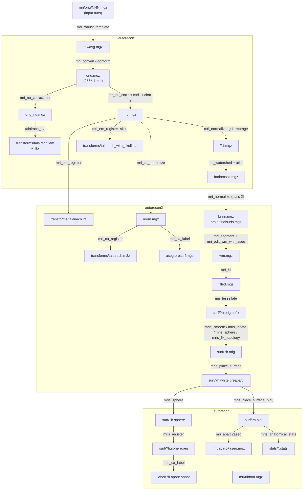

# recon-all

## Overview

`recon-all` is the master cortical reconstruction pipeline of FreeSurfer.
Given one or more T1-weighted MRI volumes of a subject, it produces a
complete set of anatomical derivatives: an intensity-normalised volume,
a subcortical segmentation ("aseg"), white and pial cortical surfaces
for each hemisphere, spherical registration to a group atlas, cortical
parcellations (Desikan–Killiany, Destrieux, DKT), and tabulated
per-region morphometric statistics. Conceptually it glues together
roughly three dozen FreeSurfer binaries, enforces their input/output
contracts, and imposes a fixed processing order.

Physically it is a large tcsh script at
`scripts/recon-all` (10128 lines in FreeSurfer 8.2.0). Each
*processing directive* on the command line — `-all`, `-autorecon1`,
`-autorecon2`, `-autorecon3`, or any individual `-<stage>` flag — sets
a corresponding `Do<Stage>` variable; the body of the script then walks
through every stage and runs each block whose `Do<Stage>` flag is 1.
The entire command line is echoed to `scripts/recon-all.cmd`; stdout/stderr
are teed into `scripts/recon-all.log`; and the status line for each stage
is written to `scripts/recon-all-status.log`.

> [!internal] Source entry points
> Stage dispatch flags are declared at
> `scripts/recon-all:322–391`. The `-all`, `-autorecon1`, `-autorecon2`
> and `-autorecon3` case statements are at
> `scripts/recon-all:7198–7465`. The canonical numbered stage listing
> printed by `-help` is at `scripts/recon-all:8839–8877`.

## Basic Usage

```bash
# Process a new subject from a DICOM or NIfTI T1 scan
recon-all -i /path/to/T1.nii.gz -s subject_id -all

# Run only autorecon1 (volume preparation)
recon-all -s subject_id -autorecon1

# Resume from autorecon2 onward (typically after editing brainmask/wm)
recon-all -s subject_id -autorecon2 -autorecon3
```

Related entry points for non-standard inputs:

- [[recon-all-clinical.sh]] — rapid clinical variant using SynthSeg/SynthSR shortcuts for clinical/non-isotropic scans.
- [[recon-all-exvivo]] — ex vivo tissue reconstruction variant.
- [[infant-recon-all]] — pediatric pipeline for ages 0–4.5 years.

## Source Information

- **Language:** tcsh (shell script)
- **Source file:** `scripts/recon-all` (10128 lines, v8.2.0)
- **Installed location:** `$FREESURFER_HOME/bin/recon-all`

## Prerequisites

- **Environment:** `$FREESURFER_HOME` must be sourced
  (`source $FREESURFER_HOME/SetUpFreeSurfer.sh`), which provides
  `FREESURFER_HOME`, `SUBJECTS_DIR`, and adds `$FREESURFER_HOME/bin`
  to `PATH`. A valid license file is required.
- **Input data:** one or more T1-weighted volumes per subject. Multiple
  contrasts (T2, FLAIR) are optional. Any format readable by
  [[wiki/tools/mri_convert|mri_convert]] is accepted (DICOM, NIfTI, MGH/MGZ, ANALYZE, …).
- **Assumptions on T1:** approximately 1 mm isotropic resolution, FOV
  ≤ 256 mm in each dimension. Non-isotropic data is silently conformed
  (see `-conform` / `-cm` gotchas below). Non-standard contrasts may
  require the `-mprage` / `-washu_mprage` flags.
- **Shell:** `/bin/tcsh -f`. The script contains guards against known
  bugs in tcsh 6.17.06.
- **Binaries:** every tool listed in `tools_involved:` above must be
  on `PATH`; the default install at `$FREESURFER_HOME/bin/` satisfies
  this.

## Directive-to-Stage Map

The three umbrella directives decompose into the following `Do<Stage>`
flags (from `scripts/recon-all:7198–7465`). A blank cell means the flag
is left at its default (0 unless otherwise set earlier in the script).

| Stage variable           | `-all`/`-autorecon-all` | `-autorecon1` | `-autorecon2` | `-autorecon3` |
|--------------------------|:--:|:--:|:--:|:--:|
| `DoMotionCor`            | ✓  | ✓  |    |    |
| `DoTalairach`            | ✓  | ✓  |    |    |
| `DoTalCheck`             | ✓  | ✓  |    |    |
| `DoNuIntensityCor`       | ✓  | ✓  |    |    |
| `DoNormalization`        | ✓  | ✓  |    |    |
| `DoSkullStrip`           | ✓  | ✓  |    |    |
| `DoGCAReg`               | ✓  |    | ✓  |    |
| `DoCANormalize`          | ✓  |    | ✓  |    |
| `DoCAReg`                | ✓  |    | ✓  |    |
| `DoCALabel`              | ✓  |    | ✓  |    |
| `DoNormalization2`       | ✓  |    | ✓  |    |
| `DoMaskBFS`              | ✓  |    | ✓  |    |
| `DoSegmentation`         | ✓  |    | ✓  |    |
| `DoFill`                 | ✓  |    | ✓  |    |
| `DoTessellate`           | ✓  |    | ✓  |    |
| `DoSmooth1`, `DoInflate1`| ✓  |    | ✓  |    |
| `DoQSphere`, `DoFix`     | ✓  |    | ✓  |    |
| `DoAutoDetGWStats`, `DoWhitePreAparc`, `DoCortexLabel` | ✓ | | ✓ | |
| `DoSmooth2`, `DoInflate2`, `DoCurvHK` | ✓ | | ✓ | |
| `DoSphere`, `DoSurfReg`, `DoJacobianWhite` | ✓ | | | ✓ |
| `DoAvgCurv`              | ✓  |    |    | ✓  |
| `DoCortParc`, `DoCortParc2`, `DoCortParc3` | ✓ | | | ✓ |
| `DoWhiteSurfs`, `DoPialSurfs` | ✓  |    |    | ✓  |
| `DoCurvStats`            | ✓  |    |    | ✓  |
| `DoCortRibbonVolMask`    | ✓  |    |    | ✓  |
| `DoParcStats`, `DoParcStats2`, `DoParcStats3` | ✓ | | | ✓ |
| `DoPctSurfCon`           | ✓  |    |    | ✓  |
| `DoRelabelHypos`         | ✓  |    |    | ✓  |
| `DoAParc2ASeg`, `DoAPas2ASeg` | ✓ | | | ✓ |
| `DoSegStats`             | ✓  |    |    | ✓  |
| `DoWMParc`               | ✓  |    |    | ✓  |
| `DoBaLabels`             | ✓  |    |    | ✓  |

> [!gotcha] Help-text stage numbering vs. code order
> The `-help` output (lines 8839–8877) lists stage 2 as *"NU (Non-Uniform
> intensity normalization)"* and stage 3 as *"Talairach transform
> computation"*. In the actual code, the `DoTalairach` block (lines
> 1738–2019) runs first and itself calls `mri_nu_correct.mni` *twice*:
> once as pre-processing for `talairach_avi` (producing `orig_nu.mgz`,
> no `--uchar`) and a second pass under `DoNuIntensityCor` (lines
> 2047–2104) that uses the now-existing `talairach.xfm` with `--uchar`
> to produce `nu.mgz`. The numbered help description is a conceptual
> summary; the code order is Motion → Talairach (with internal nu) →
> Nu (with uchar) → Norm1 → SkullStrip.

## Processing Stages

The stages below are grouped by directive. For each stage we give the
exact command line assembled by `recon-all` (with script variables
resolved to their typical default values for the `-all` directive on a
cross-sectional 1.5 T 1 mm T1). Optional branches are noted.

### autorecon1

The "volume preparation" directive. Turns one or more raw T1 volumes
into a bias-corrected, skull-stripped, 256³ 1 mm isotropic brain volume
that is the input for every subsequent stage.

#### Stage 1 — Motion Correction and Conform (`DoMotionCor`)

**Source lines:** `scripts/recon-all:1366–1593`.

Inputs: one or more `$SUBJECTS_DIR/<subj>/mri/orig/0NN.mgz` volumes.

1. **Input conversion** (only if `-i <vol>` was given): one
   [[wiki/tools/mri_convert|mri_convert]] call per input:
   ```bash
   mri_convert <input> $SUBJECTS_DIR/<subj>/mri/orig/0NN.mgz
   ```
2. **Motion correction** (if >1 run): by default uses
   [[mri_robust_template]]:
   ```bash
   mri_robust_template \
       --mov <orig/001.mgz> <orig/002.mgz> ... \
       --average 1 \
       --template $SUBJECTS_DIR/<subj>/mri/rawavg.mgz \
       --satit --inittp 1 --fixtp --noit --iscale \
       --iscaleout <runN-iscale.txt> ... \
       --subsample 200 \
       --lta <orig/001.lta> <orig/002.lta> ...
   ```
   With `-nomcfsl 0` (legacy), `mri_motion_correct.fsl -o rawavg.mgz
   -wild 0NN.mgz` is used instead. If exactly one run is found, the
   script `cp`s it to `rawavg.mgz` with no registration.
3. **Conform to COR FOV 256³ 1 mm**:
   ```bash
   mri_convert rawavg.mgz orig.mgz --conform
   ```
   With `-cm` / `ConformMin`, `--conform_min` is used instead (for
   hi-res data). With `-cw256` or when `tmp/cw256` exists (the default
   when FOV > 256), `--cw256` is appended.
4. **Placeholder Talairach stamp**: even before the actual Talairach
   stage runs, the script writes a non-existent transform path into
   the header to avoid later time-stamp races:
   ```bash
   mri_add_xform_to_header -c transforms/talairach.xfm orig.mgz orig.mgz
   ```
5. **rawavg → orig LTA for provenance**:
   ```bash
   lta_convert --inlta identity.nofile --src rawavg.mgz \
       --trg orig.mgz --outlta transforms/rawavg2orig.lta \
       --subject <subj>
   ```
6. **Optional SynthStrip short-circuit**: if the environment enables
   `$SynthStrip`, the script runs [[mri_synthstrip]] here
   (`mri_synthstrip --threads $OMP_NUM_THREADS -i orig.mgz -o synthstrip.mgz`)
   and later bypasses `mri_watershed`. See gotcha below.

Outputs: `mri/rawavg.mgz`, `mri/orig.mgz`, `mri/transforms/rawavg2orig.lta`.

> [!assumption] FOV must be ≤ 256 mm
> After Stage 1 the script probes `orig.mgz` with `mri_info | grep fov`.
> If the reported FOV exceeds 256 the script errors out with
> "ERROR! FOV=... > 256" and instructs the user to re-run with
> `-cw256`. (`scripts/recon-all:1581–1591`.)

#### Stage 2/3 — Talairach (`DoTalairach`)

**Source lines:** `scripts/recon-all:1738–2041`.

Conceptually "Stage 3" in the help text, but executed before the
standalone NU stage (see gotcha above).

1. **Pre-bias correction** of the full head for robustness of
   registration:
   ```bash
   mri_nu_correct.mni --no-rescale --i orig.mgz --o orig_nu.mgz \
       --n 1 --proto-iters 1000 --distance 50
   ```
   With `-3T`, `--proto-iters 1000 --distance 50` stays (the code
   preserves the same numbers at 1.5 T and 3 T in v8). With
   `-ants-n3` or `-ants-n4`, the ANTs N3/N4 wrappers replace the MINC
   `nu_correct`. With `-nu-use-tal`, the already-bias-corrected
   `nu.mgz` is reused instead.
2. **Affine registration to MNI305** using Avi Snyder's 4dfp tools:
   ```bash
   talairach_avi --i orig_nu.mgz --xfm transforms/talairach.auto.xfm
   ```
   Optional flags:
   - `--atlas 3T18yoSchwartzReactN32_as_orig` (from `-schwartzya3t-atlas`)
   - `--atlas <user-name>` (from `-custom-tal-atlas <name>`)
   The script falls back to MINC's `talairach` (`talairach --i ... --xfm ...`)
   when `-use-mritotal` is passed, and to `run_samseg --reg-only` when
   `-samseg-reg` is passed.
3. **Install transform**: unless the user has already edited
   `talairach.xfm`, the script `cp`s `talairach.auto.xfm` to
   `talairach.xfm`. A pre-existing `talairach.xfm` is only overwritten
   when `-clean-tal` is specified.
4. **Convert to LTA** (only for downstream tools that want an LTA):
   ```bash
   lta_convert --src orig.mgz \
       --trg $FREESURFER_HOME/average/mni305.cor.mgz \
       --inxfm transforms/talairach.xfm \
       --outlta transforms/talairach.xfm.lta \
       --subject fsaverage --ltavox2vox
   ```
5. **Optional QA** (`DoTalCheck`): runs `talairach_afd -T 0.005 -xfm
   transforms/talairach.xfm` and Avi's z-score check against the
   Buckner-40 reference (mean 0.9781, std 0.0044). A `z < −9`
   triggers an automatic retry using the 3T atlas, then a fallback to
   MINC `mritotal`, then error exit.

Outputs: `mri/orig_nu.mgz`, `mri/transforms/talairach.auto.xfm`,
`mri/transforms/talairach.xfm`, `mri/transforms/talairach.xfm.lta`.

> [!gotcha] `-clean-tal` vs. preserving edits
> `talairach.xfm` is the file a user is expected to manually edit when
> QA fails. Because of this, `recon-all` will *not* overwrite an
> existing `talairach.xfm` even when re-running `-autorecon1` — unless
> the user also passes `-clean-tal`. Silent preservation of manual
> edits is the intended behaviour.

#### Stage 2 — NU Intensity Correction (`DoNuIntensityCor`)

**Source lines:** `scripts/recon-all:2047–2104`.

```bash
mri_nu_correct.mni --i orig.mgz --o nu.mgz \
    --uchar transforms/talairach.xfm \
    --n 2
```

- `--n 2` is the default number of N3 iterations (controlled by
  `-nuiterations`; the 3T defaults to `--n 1 --proto-iters 1000
  --distance 50`).
- `--uchar transforms/talairach.xfm` triggers `mri_make_uchar`, which
  uses the (now-existing) Talairach transform to locate a "ball of
  mostly-brain voxels", finds the WM peak of its intensity histogram,
  and rescales the volume so the peak lands at intensity ~110 (an
  `uint8` histogram-centring step). This compensates for histograms
  distorted by extracranial voxels.
- `--cm` is appended for hi-res (`ConformMin`) data.
- `-ants-n3` / `-ants-n4` replace the MINC backend with the ANTs N3/N4
  wrappers (and ignore the `--n`/`--proto-iters`/`--distance` flags).
- Finally the script stamps `transforms/talairach.xfm` into the header
  of `nu.mgz` with `mri_add_xform_to_header -c`.

Outputs: `mri/nu.mgz` (with Talairach transform in header).

> [!gotcha] The "hidden" first mri_nu_correct.mni
> `mri_nu_correct.mni` is actually called *twice* during autorecon1:
> once inside the `talairach:` block with `--no-rescale` (producing
> `orig_nu.mgz` for registration only), and once here under
> `DoNuIntensityCor` with `--uchar` (producing `nu.mgz`, the
> bias-corrected + histogram-centred volume used everywhere
> downstream). A `-noskip-nuintensitycor` directive only suppresses
> the *second* call.

#### Stage 4 — Intensity Normalization 1 (`DoNormalization`)

**Source lines:** `scripts/recon-all:2120–2210`.

```bash
mri_normalize -g 1 -seed 1234 -mprage nu.mgz T1.mgz
```

Other flags that may be inserted:

- `-f <control.dat>` if the user supplied control points.
- `-n <NormIters>` to override 3-D normalisation iteration count
  (default is whatever `mri_normalize` hard-codes).
- `-b <below>` to change the "accept as WM" threshold in intensity
  units below the target.
- `-mprage` (on by default via `IsMPRAGE=1`) or `-washu_mprage`, for
  the corresponding scan protocols.
- `-noconform` when `ConformMin` is set (hi-res).
- `-W ctrl_vol.mgz bias_vol.mgz` when running as the longitudinal
  *base* subject, to write out the control-point volume and estimated
  bias field for reuse across time points.

Outputs: `mri/T1.mgz` (and, for the longitudinal base, `mri/ctrl_vol.mgz`,
`mri/bias_vol.mgz`).

#### Stage 5 — Skull Strip (`DoSkullStrip`)

**Source lines:** `scripts/recon-all:2286–2645`.

The behaviour depends on three switches:

- **`$SynthStrip`** (environment / `-use-synthstrip` / `-synthstrip`):
  if set, the precomputed `synthstrip.mgz` from Stage 1 is applied to
  `T1.mgz`:
  ```bash
  mri_mask T1.mgz synthstrip.mgz brainmask.mgz
  ```
  The classical `mri_watershed` block is skipped.
- **Custom mask** (`-xmask <file>`): the custom mask in
  `mri/orig/rawmask.mgz` is resampled to `orig.mgz` space with
  [[mri_vol2vol]] and applied via `mri_mask`.
- **Default (classical) path**:
  1. If `WSGcaAtlas=1` (the default) and
     `transforms/talairach_with_skull.lta` does not yet exist, run a
     skull-aware atlas registration:
     ```bash
     mri_em_register -skull nu.mgz \
         $FREESURFER_HOME/average/RB_all_withskull_<date>.gca \
         transforms/talairach_with_skull.lta
     ```
  2. Run the watershed:
     ```bash
     mri_watershed -T1 \
         -brain_atlas $FREESURFER_HOME/average/RB_all_withskull_<date>.gca \
         transforms/talairach_with_skull.lta \
         T1.mgz brainmask.auto.mgz
     ```
     Additional options are appended from the `WSLess` / `WSMore` /
     `WSAtlas` / `WSCopy` / `WSPctPreFlood` / `WSSeedPoint` flags, and
     the user can pass any extra options via the `mri_watershed` line
     of the expert options file. If `optimal_skullstrip_invol` exists,
     the script uses that volume (e.g. `orig.mgz`) instead of `T1.mgz`
     and post-masks with `mri_mask T1.mgz brainmask.auto.mgz
     brainmask.auto.mgz`.
  3. If `DoGcut=1`, additionally run `mri_gcut` to shave dura off the
     result.
  4. If `DoMultiStrip=1`, the script runs `mri_watershed` for each
     `(vol, preflood_height)` in the product `{orig,orig_nu,T1} ×
     {5,10,20,30}`, measures goodness of fit with `mri_log_likelihood
     -orig T1.mgz <bma> <gca> <skull_lta>`, and keeps the best.
- **Install mask**: unless `brainmask.mgz` already exists and
  `-clean-bm` was not specified, `cp brainmask.auto.mgz brainmask.mgz`.

Outputs: `mri/brainmask.auto.mgz`, `mri/brainmask.mgz` (and
`mri/transforms/talairach_with_skull.lta` when classical path is
used).

> [!gotcha] SynthStrip vs. watershed coexist in the same script
> In v8.2.0 the `-use-synthstrip` path short-circuits *both* the
> `mri_em_register` skull atlas step and the `mri_watershed` call, but
> the `talairach_with_skull.lta` file is *not* produced in that case.
> Tools that later expect this LTA (e.g. custom pipelines using
> `mri_ca_label` with a skull-preserving atlas) may error out. See
> [[mri_synthstrip]] for the full list of downstream consequences.

### autorecon2

The "volumetric+surface generation" directive. Produces the canonical
atlas-registered volumes (`norm.mgz`, `aseg.presurf.mgz`,
`brain.mgz`, `wm.mgz`, `filled.mgz`), the hemisphere masks, and the
initial white surfaces through the "pre-aparc" stage.

#### Stage 6 — EM Register (`DoGCAReg`)

**Source lines:** `scripts/recon-all:2655–2694`.

```bash
mri_em_register -uns 3 -mask brainmask.mgz \
    nu.mgz $FREESURFER_HOME/average/RB_all_<date>.gca \
    transforms/talairach.lta
```

- `-uns 3` ("unsearched" neighbourhood size) is the default.
- For a `-base` subject, `norm_template.mgz` is used as input instead
  of `nu.mgz` and the `-mask brainmask.mgz` form is preserved.
- For the longitudinal `-long` time-points the stage is skipped; the
  base subject's `talairach.lta` is copied in `rca-long-tp-init`.
- When `EMRegAseg=0`, `talairach.lta` is replaced by a symlink to
  `talairach.xfm.lta`.

Output: `mri/transforms/talairach.lta`.

#### Stage 7 — CA Normalize (`DoCANormalize`)

**Source lines:** `scripts/recon-all:2700–2749`.

```bash
mri_ca_normalize -c ctrl_pts.mgz -mask brainmask.mgz \
    nu.mgz $FREESURFER_HOME/average/RB_all_<date>.gca \
    transforms/talairach.lta norm.mgz
```

Outputs: `mri/norm.mgz`, `mri/ctrl_pts.mgz`.

#### Stage 8 — CA Register (`DoCAReg`)

**Source lines:** `scripts/recon-all:2756–2809`. The slowest stage
in `-all`.

```bash
mri_ca_register -nobigventricles -T transforms/talairach.lta \
    -align-after -mask brainmask.mgz \
    norm.mgz $FREESURFER_HOME/average/RB_all_<date>.gca \
    transforms/talairach.m3z
```

Flags may add `-bigventricles -smoothness 0.5`, `-uncompress`,
`-secondpassrenorm`, `-n <iters>`, `-tol <tol>`, or (longitudinal
only) `-levels 2 -A 1 -l <base talairach.m3z> identity.nofile`.

Output: `mri/transforms/talairach.m3z` (the non-linear warp to the
GCA atlas).

#### Stages 9, 10 — Remove Neck / Recompute with Skull

Only run when `-rmneck` / `-skull-lta` are explicitly requested
(default off). Call `mri_remove_neck` to produce
`mri/nu_noneck.mgz`, then `mri_em_register -skull` again to produce
`mri/transforms/talairach_with_skull_2.lta`.

#### Stage 11 — CA Label (`DoCALabel`)

**Source lines:** `scripts/recon-all:2904–3065`.

Produces `mri/aseg.auto_noCCseg.mgz` via `mri_ca_label`, with
`-align` by default. Post-processing includes corpus-callosum
segmentation (`mri_cc`), and edit merging (`mri_seg_diff` /
`mri_segment`) to propagate any user edits from a previous run.

Outputs: `mri/aseg.auto.mgz`, `mri/aseg.presurf.mgz`.

#### Stage 12 — Intensity Normalization 2 (`DoNormalization2`)

**Source lines:** `scripts/recon-all:3116–3153`.

Second pass of [[mri_normalize]], now guided by the subcortical segmentation so that normalization honours true tissue boundaries rather than raw intensity histograms:

```bash
mri_normalize -mprage -aseg aseg.presurf.mgz -mask brainmask.mgz \
    norm.mgz brain.mgz
```

Optional flag insertions:

- `-seed 1234` when `-norandomness` is active.
- `-f <control.dat>` if the user supplied control points.
- `-n <Norm2_n>` / `-b <Norm2_b>` to override the default iteration count or "accept-as-WM" threshold.
- `-mprage` / `-washu_mprage` protocol hints (mirrors Normalization 1).
- `-noconform` when `ConformMin` is set (hi-res).
- If `NoNormMGZ=1` (user passed `-noaseg` or `-nosubcortseg`), `norm.mgz` does not exist, so the input becomes `brainmask.mgz` and the `-aseg` flag is dropped.
- `-noaseginorm2` suppresses the `-aseg aseg.presurf.mgz` input even when it is available.

Outputs: `mri/brain.mgz`.

#### Stage 13 — Create BrainFinalSurfs (`DoMaskBFS`)

**Source lines:** `scripts/recon-all:3159–3248`.

Produces the intensity-normalised, re-masked volume that all surface-placement steps in autorecon3 read as `--invol`:

```bash
mri_mask -T 5 brain.mgz brainmask.mgz brain.finalsurfs.mgz
```

Post-processing:

1. **MCA / Dura / VSinus** suppression (if `FixMCADura` or `FixVSinus`): invert-masks the auxiliary segmentations produced earlier into `brain.finalsurfs.mgz`.
2. **Ento-WM / ACJ fixes** (if `FixEntoWM` / `FixACJ`): call [[mri_edit_wm_with_aseg]] with `-sa-fix-ento-wm` / `-sa-fix-acj` to re-assert WM intensity in anatomically suspect regions.
3. **Manual edit transfer**: if a pre-existing `brain.finalsurfs.manedit.mgz` exists (from a prior run or, in longitudinal processing, from the cross-sectional or base subject), `mri_mask -transfer 255 -keep_mask_deletion_edits` propagates those edits into the fresh `brain.finalsurfs.mgz`. Edits are voxels valued 255 (inserted) or 1 (deleted).
4. **Manedit seed**: if no manedit file exists, the freshly-produced `brain.finalsurfs.mgz` is copied to `brain.finalsurfs.manedit.mgz` so that downstream edits can accumulate there.

Outputs: `mri/brain.finalsurfs.mgz`, `mri/brain.finalsurfs.manedit.mgz`.

> [!gotcha] brain.finalsurfs manedits survive re-runs
> Once `brain.finalsurfs.manedit.mgz` exists, Stage 13 treats it as an input whose edits are transferred back onto the freshly-masked volume. This is intentional — it is the mechanism by which manual pial-surface corrections persist through re-runs — but it means an edited manedit will silently override a user's attempts to revert.

#### Stage 14 — WM Segmentation (`DoSegmentation`)

**Source lines:** `scripts/recon-all:3254–3426`.

Produces `wm.mgz`, the binary white-matter volume from which the initial surface is tessellated. Four sub-steps:

1. **Preserve prior edits**: if `wm.mgz` already exists and was edited (contains voxels valued 1 or 255), save it to `wm.seg.mgz` and disable longitudinal WM transfers for this run.
2. **Segment**. Default path uses [[mri_segment]] on the bias-corrected brain:
   ```bash
   mri_segment -wsizemm $MriSegWsizemm -mprage \
       $WMSeg_wlo $WMSeg_ghi \
       brain.mgz wm.seg.mgz
   ```
   If `-ants-denoising` is active, the input becomes `antsdn.brain.mgz` (produced by `AntsDenoiseImageFs`). With `-wmseg-from-aseg`, [[mri_segment]] is skipped: [[mri_binarize]] `--match 2 41` extracts the WM voxels from `aseg.presurf.mgz`, they are masked into `brain.mgz` to build `wm.seg.mgz`, and [[wiki/tools/mri_convert|mri_convert]] `-odt uchar --no_scale 1` coerces to uint8 for downstream tools.
3. **Edit WM with aseg**:
   ```bash
   mri_edit_wm_with_aseg -keep-in \
       wm.seg.mgz brain.mgz aseg.presurf.mgz wm.asegedit.mgz
   ```
   Flags `-fix-ento-wm entowm.mgz 3 255 255` (with `FixEntoWM`), `-fix-acj aseg.presurf.mgz 255 255` (with `FixACJ`), `-wmsa aseg.presurf.mgz` (with `SynthSegForSurf`), or `-fill-seg-wm` (with `UseSynthSeg`) may be appended.
4. **Pre-tessellation binarization**:
   ```bash
   mri_pretess wm.asegedit.mgz wm norm.mgz wm.mgz
   ```
   [[mri_pretess]] enforces topological consistency (no voxel-corner shared by four same-label voxels) before tessellation. If `FixEntoWM` or `FixACJ` are active, `mri_edit_wm_with_aseg -sa-fix-ento-wm` / `-sa-fix-acj` is run again on `wm.mgz` because `mri_pretess` may have flipped the fixup voxels.
5. **Longitudinal WM edit transfer** (only in `-long` and only when no local WM edits were detected): `mri_mask -transfer 255 -keep_mask_deletion_edits -xform <base→tpN.lta>` copies WM edits from the base (or cross-sectional) subject into the time-point's `wm.mgz`.

Outputs: `mri/wm.seg.mgz`, `mri/wm.asegedit.mgz`, `mri/wm.mgz`.

#### Stage 15 — Fill (`DoFill`)

**Source lines:** `scripts/recon-all:3431–3475`. Not run in longitudinal time-points (they inherit from base).

```bash
mri_fill -a ../scripts/ponscc.cut.log \
    -xform transforms/talairach.lta \
    -segmentation aseg.presurf.mgz \
    -topofix norm.mgz \
    wm.mgz filled.mgz
```

- `-Pv`, `-Cv`, `-lhv`, `-rhv` seed coordinates may be added from `-pons-crs` / `-cc-crs` / `-lh-crs` / `-rh-crs` user flags.
- `-lhonly` / `-rhonly` restrict the fill to a single hemisphere.
- `-topofix norm.mgz` is appended unless `-use-old-topofix` is set.
- With `FS_ALLOW_FILLED_EDIT`, the script maintains `filled.auto.mgz` alongside `filled.mgz` and calls `-auto-man` so edits to `filled.mgz` can persist across re-runs (voxel differences are logged to `tmp/filled.edits.txt`).

In longitudinal processing the base's `filled.mgz` is copied into the time-point directory — the long orig surface comes from the base, but the filled volume is still needed for stop-mask generation.

Outputs: `mri/filled.mgz`, `scripts/ponscc.cut.log`, and (with edit tracking) `mri/filled.auto.mgz`.

#### Stage 16 — Tessellate (`DoTessellate`)

**Source lines:** `scripts/recon-all:3547–3609`. Per-hemisphere. Not run in longitudinal time-points.

`lh` is encoded as voxel value 255 in `filled.mgz`, `rh` as 127.

```bash
# per hemi ($hv = 255 for lh, 127 for rh)
mri_pretess ../mri/filled.mgz $hv ../mri/norm.mgz ../mri/filled-pretess$hv.mgz
mri_tessellate ../mri/filled-pretess$hv.mgz $hv ../surf/$hemi.orig.nofix
mris_extract_main_component ../surf/$hemi.orig.nofix ../surf/$hemi.orig.nofix
rm -f ../mri/filled-pretess$hv.mgz
```

- [[mri_pretess]] is run a second time (per F. Segonne's note in the code) to ensure a topologically clean volume for this hemisphere's binarization.
- [[mris_extract_main_component]] discards stray islands.
- With `-decimate`, the surface is produced at `$hemi.orig.nofix.predec` and then reduced by [[mris_remesh]] `--desired-face-area $DecimationFaceArea`.

Outputs: `surf/?h.orig.nofix`.

#### Stage 17 — Smooth1 (`DoSmooth1`)

**Source lines:** `scripts/recon-all:3614–3643`. Per-hemisphere.

```bash
mris_smooth -nw ../surf/$hemi.orig.nofix ../surf/$hemi.smoothwm.nofix
```

- `-nw` suppresses writing of curvature/area files (re-done after topology fix).
- `-seed $RngSeed` under `-norandomness`.
- When `-parallel`, per-hemi calls are batched via `reconbatchjobs`.

Outputs: `surf/?h.smoothwm.nofix`.

#### Stage 18 — Inflate1 (`DoInflate1`)

**Source lines:** `scripts/recon-all:3648–3676`. Per-hemisphere.

```bash
mris_inflate -no-save-sulc ../surf/$hemi.smoothwm.nofix ../surf/$hemi.inflated.nofix
```

- `-no-save-sulc` skips writing `?h.sulc` — the real sulc file is produced after Inflate2, from the topology-corrected surface.

Outputs: `surf/?h.inflated.nofix`.

#### Stage 19 — QSphere (`DoQSphere`)

**Source lines:** `scripts/recon-all:3681–3709`. Per-hemisphere.

A *quick* spherical mapping used only as a scaffold for the topology fixer:

```bash
mris_sphere -q -p 6 -a 128 \
    ../surf/$hemi.inflated.nofix ../surf/$hemi.qsphere.nofix
```

- `-q` = quick mode, `-p 6` = 6 outer iterations, `-a 128` = 128 averaging iterations.

Outputs: `surf/?h.qsphere.nofix`.

#### Stage 20 — Fix Topology (`DoFix`)

**Source lines:** `scripts/recon-all:3715–3861`. Per-hemisphere. Not run in longitudinal.

Default path uses the classical [[mris_fix_topology]]; if the surface still has a non-zero defect index after this step, the script automatically falls back to the newer [[mris_topo_fixer]].

```bash
# classical fixer (default)
mris_fix_topology -threads 1 -mgz \
    -sphere qsphere.nofix -inflated inflated.nofix -orig orig.nofix \
    -out orig $subjid $hemi

# verification
mris_euler_number ../surf/$hemi.orig
# if total defect index != 0:
mris_topo_fixer -orig_name orig.nofix -out_name orig -mgz -warnings \
    $subjid $hemi
```

- `-threads 1` is forced: [[mris_fix_topology]] becomes non-deterministic with multiple threads (observed on ≈3/40 Buckner subjects).
- `-ga` (genetic algorithm) is appended when `FixWithGA` is set.
- `-use-new_fixer` skips the classical fixer entirely and goes straight to [[mris_topo_fixer]].
- After topology is fixed, [[defect2seg]] converts the defect list into a segmentation for visualization, and [[mris_remove_intersection]] cleans up any surface self-intersections introduced by the fix.
- With `-remesh`, an additional pass of [[mris_remesh]] `--remesh --iters 3` improves triangle quality (the un-remeshed surface is archived as `$hemi.orig.premesh`).

Outputs: `surf/?h.orig`, `surf/?h.defect_labels`, `surf/?h.defect_chull`, `mri/defects.mgz`.

> [!gotcha] Automatic topo-fixer fallback
> If `mris_euler_number` on the fixed surface reports a defect index ≠ 0, recon-all silently retries with `mris_topo_fixer` on that hemisphere. Users scanning recon-all.log for topology errors should check for *both* `#@# Fix Topology` and a subsequent `Trying new mris_topo_fixer on` line before concluding which fixer produced the final `?h.orig`.

#### Stage 21 — Autodet GW Stats (`DoAutoDetGWStats`)

**Source lines:** `scripts/recon-all:3865–3893`. Per-hemisphere.

Estimates the white-matter / grey-matter intensity distributions that [[mris_place_surface]] will use as stopping criteria:

```bash
mris_autodet_gwstats --o ../surf/autodet.gw.stats.$hemi.dat \
    --i brain.finalsurfs.mgz --wm wm.mgz --surf ../surf/$hemi.orig \
    $WMSeg_wlo $WMSeg_ghi
```

- With `-remesh`, uses `$hemi.orig.premesh` instead of `$hemi.orig` (the script author notes this makes a measurable difference).

Outputs: `surf/autodet.gw.stats.?h.dat`.

#### Stage 21b — StopMaskSCM (optional, `UseStopMaskSCM`)

**Source lines:** `scripts/recon-all:3895–3923`.

Only runs when `-stopmask-scm` is passed. Produces a shape-constrained mask that [[mris_place_surface]] can consume via `--stopmask` to prevent the white surface from crossing into ventricles or WMSA:

```bash
mri_stopmask --o stopmask.scm.mgz --aseg aseg.presurf.mgz \
    --filled filled.auto.mgz filled.mgz \
    --wm wm.mgz --bfs brain.finalsurfs.mgz \
    --lv --wmsa 1
```

Outputs: `mri/stopmask.scm.mgz`.

#### Stage 22 — White PreAparc (`DoWhitePreAparc`)

**Source lines:** `scripts/recon-all:3925–3963`. Per-hemisphere.

Produces the initial white-matter surface — "pre-aparc" because the Desikan–Killiany parcellation has not yet been computed to guide per-region placement.

```bash
mris_place_surface --adgws-in ../surf/autodet.gw.stats.$hemi.dat \
    --wm wm.mgz --threads $OMP_NUM_THREADS \
    --invol brain.finalsurfs.mgz --$hemi \
    --i ../surf/$hemi.orig --o ../surf/$hemi.white.preaparc \
    --white --seg aseg.presurf.mgz --nsmooth 5
```

- `--nsmooth 5` (cross-sectional default) or `--max-cbv-dist 3.5` (longitudinal) differs in how far the surface may travel in each iteration.
- `--restore-255` is added with `FixEntoWM` / `FixACJ`.
- `--stopmask stopmask.scm.mgz` when the SCM stop-mask was produced in Stage 21b.

Outputs: `surf/?h.white.preaparc`.

#### Stage 23 — Cortex Label (`DoCortexLabel`)

**Source lines:** `scripts/recon-all:3965–4004`. Per-hemisphere.

Converts the white surface into the `cortex.label` mask used by every subsequent surface-based statistic, via the [[label-cortex]] wrapper script. Also produces `cortex+hipamyg.label`, a variant that includes hippocampus and amygdala labels, needed when placing the pial surface near MTL structures:

```bash
label-cortex --s $subjid --$hemi
mri_label2label --label-cortex \
    ../surf/$hemi.white.preaparc \
    ../mri/aseg.presurf.mgz \
    1 ../label/$hemi.cortex+hipamyg.label
```

Outputs: `label/?h.cortex.label`, `label/?h.cortex+hipamyg.label`.

#### Stage 24 — Smooth2 (`DoSmooth2`)

**Source lines:** `scripts/recon-all:4009–4039`. Per-hemisphere.

Re-smooths the topology-fixed white surface to produce the canonical `?h.smoothwm` used by display and curvature computation:

```bash
mris_smooth -n 3 -nw \
    ../surf/$hemi.white.preaparc ../surf/$hemi.smoothwm
```

- `-n 3` iterations (distinct from Smooth1's default of 10), `-nw` suppresses curv/area writing (re-done by `mris_curvature_stats` later).

Outputs: `surf/?h.smoothwm`.

#### Stage 25 — Inflate2 (`DoInflate2`)

**Source lines:** `scripts/recon-all:4044–4071`. Per-hemisphere.

```bash
mris_inflate ../surf/$hemi.smoothwm ../surf/$hemi.inflated
```

- Unlike Inflate1, the default (no `-no-save-sulc`) here *does* write the `?h.sulc` curvature file used by [[mris_register]] and downstream group-level analyses.

Outputs: `surf/?h.inflated`, `surf/?h.sulc`.

#### Stage 26 — Curvature .H and .K (`DoCurvHK`)

**Source lines:** `scripts/recon-all:4077–4163`. Per-hemisphere.

Computes mean and Gaussian curvature on the white and inflated surfaces:

```bash
# on the white.preaparc surface → ?h.white.preaparc.{H,K}
mris_curvature -w $hemi.white.preaparc

# canonical filenames expected by downstream tools are ?h.white.{H,K};
# the script provides these via symlinks:
ln -s $hemi.white.preaparc.H $hemi.white.H
ln -s $hemi.white.preaparc.K $hemi.white.K

# on the inflated surface → ?h.inflated.{H,K}
mris_curvature -thresh .999 -n -a 5 -w -distances 10 10 $hemi.inflated
```

- `-thresh .999` clamps outliers to the 99.9th percentile.
- `-a 5` applies 5 iterations of post-computation smoothing.
- `-distances 10 10` selects the neighbourhood size for discrete curvature estimation.

Outputs: `surf/?h.white.preaparc.H`, `surf/?h.white.preaparc.K`, `surf/?h.white.H` (symlink), `surf/?h.white.K` (symlink), `surf/?h.inflated.H`, `surf/?h.inflated.K`.

### autorecon3

The "surface-based" directive. Produces the spherical mapping, atlas
registration, cortical parcellations, pial surfaces, ribbon masks, and
every downstream statistic.

#### Stage 27 — Sphere (`DoSphere`)

**Source lines:** `scripts/recon-all:4172–4206`. Per-hemisphere. Not run in longitudinal (spheres are copied from the base by `rca-long-tp-init`).

Full-quality spherical inflation, this time starting from the topology-corrected `?h.inflated`:

```bash
mris_sphere -threads $OMP_NUM_THREADS \
    ../surf/$hemi.inflated ../surf/$hemi.sphere
```

- `-seed $RngSeed` under `-norandomness`.
- `-remove_negative 1` with `-nonneg` (forces no negative-area triangles).

Outputs: `surf/?h.sphere`.

#### Stage 28 — Surface Registration (`DoSurfReg`)

**Source lines:** `scripts/recon-all:4212–4227`.

Delegated to the `rca-surfreg` wrapper, which calls [[mris_register]] (or [[mris_register_josa]] with `-josa`) to align the subject's sphere to the group atlas (`fsaverage.tif`) using curvature, sulcal depth, and average curvature as matching features:

```bash
rca-surfreg --s $subjid --threads $OMP_NUM_THREADS \
    --tif-path $AvgCurvTifPath --tif-name $AvgCurvTif
```

- `--$hemi` restricts to a single hemisphere.
- `--long $longbaseid` in longitudinal mode (initialises from the base's `?h.sphere.reg`).
- `--josa` uses the learned JOSA registration in place of the classical [[mris_register]] (`JosaReg=1`).

Outputs: `surf/?h.sphere.reg`.

#### Stage 29 — Jacobian White (`DoJacobianWhite`)

**Source lines:** `scripts/recon-all:4232–4261`. Per-hemisphere.

```bash
mris_jacobian \
    ../surf/$hemi.white.preaparc \
    ../surf/$hemi.sphere.reg \
    ../surf/$hemi.jacobian_white
```

Quantifies local area expansion/contraction from the white surface into the fsaverage spherical atlas — useful for downstream correction of cortical-area measurements under registration distortion.

Outputs: `surf/?h.jacobian_white`.

#### Stage 30 — Average Curvature (`DoAvgCurv`)

**Source lines:** `scripts/recon-all:4304–4332`. Per-hemisphere.

Paints the fsaverage average-curvature template onto the subject's registered sphere, producing a "what did the atlas expect here?" curvature map:

```bash
mrisp_paint -a 5 "$AvgCurvTifPath/$hemi.$AvgCurvTif#6" \
    ../surf/$hemi.sphere.reg ../surf/$hemi.avg_curv
```

- `-a 5` applies 5 iterations of surface-smoothing after paint.
- The `#6` selects the 6th frame (average curvature) from the multi-frame `.tif` atlas.

Outputs: `surf/?h.avg_curv`.

#### Stage 31 — Cortical Parcellation, DK (`DoCortParc`)

**Source lines:** `scripts/recon-all:4338–4375`. Per-hemisphere.

Applies the Desikan–Killiany 2010 atlas GCS via [[mris_ca_label]]:

```bash
mris_ca_label \
    -l ../label/$hemi.cortex.label \
    -aseg ../mri/aseg.presurf.mgz \
    $subjid $hemi ../surf/$hemi.sphere.reg \
    $FREESURFER_HOME/average/$hemi.$GCS \
    ../label/$hemi.aparc.annot
```

- `$GCS` is by default `curvature.buckner40.filled.desikan_killiany.2010-03-25.gcs`.
- In longitudinal runs, `-long -R $longbasedir/label/$hemi.aparc.annot` anchors the label to the base subject for temporal consistency.

Outputs: `label/?h.aparc.annot`.

#### Stage 32 — HighMyelin Label (optional, `UseHighMyelin`)

**Source lines:** `scripts/recon-all:4377–4395`. Per-hemisphere.

When `-high-myelin` is passed, maps the fsaverage high-myelin label onto the subject via [[mris_apply_reg]]. This label is consumed by Stage 34 to allow the white surface to pull back from cortex in highly-myelinated (bright-on-T1) regions:

```bash
mris_apply_reg \
    --src-label $FREESURFER_HOME/subjects/fsaverage/label/$hemi.high-myelin.label \
    --streg $FREESURFER_HOME/subjects/fsaverage/surf/$hemi.sphere.reg \
           ../surf/$hemi.sphere.reg \
    --trg ../label/$hemi.high-myelin.label
```

Outputs: `label/?h.high-myelin.label`.

#### Stage 33 — conf2hires (optional, `DoConf2Hires`)

**Source lines:** `scripts/recon-all:4397–4419`.

When `-hires` is active, the `conf2hires` wrapper places white and pial surfaces directly on the original (non-conformed) high-resolution volume, bypassing the plain `DoWhiteSurfs` / `DoPialSurfs` blocks below. Adds `--T2` / `--FLAIR` when the corresponding pial-refinement modality is available.

#### Stage 34 — White Surfaces (`DoWhiteSurfs`)

**Source lines:** `scripts/recon-all:4421–4490`. Per-hemisphere. Skipped when `DoConf2Hires` ran.

Re-places the white surface using the now-available cortical parcellation to modulate stopping criteria per region:

```bash
mris_place_surface \
    --adgws-in ../surf/autodet.gw.stats.$hemi.dat \
    --seg aseg.presurf.mgz --threads $OMP_NUM_THREADS \
    --wm wm.mgz --invol brain.finalsurfs.mgz --$hemi \
    --i ../surf/$hemi.white.preaparc --o ../surf/$hemi.white \
    --white --nsmooth 0 \
    --rip-label ../label/$hemi.cortex.label \
    --rip-bg --rip-surf ../surf/$hemi.white.preaparc \
    --aparc ../label/$hemi.aparc.annot
```

- `--rip-wmsa` / `--rip-lesion` mark WMSAs / lesions as non-editable when `RipWMSA` / `RipLesion` are set.
- `--alt-border-low <high-myelin.label> $HighMyelinFactor` pulls the surface away from cortex in highly-myelinated regions when Stage 32 ran.
- `--stopmask stopmask.scm.mgz` if the SCM stop-mask was produced.
- If `repos.$hemi.white.json` exists from prior user-directed point-set edits, [[mris_reposition_surface]] applies them after placement.

Outputs: `surf/?h.white`.

#### Stage 35 — T1 Pial Surfaces (`DoPialSurfs`)

**Source lines:** `scripts/recon-all:4493–4555`. Per-hemisphere. Skipped when `DoConf2Hires` ran.

Places the pial surface, pinning the medial wall to the (already-placed) white surface and using the hippocampus/amygdala-inclusive cortex+hipamyg label as the rip mask:

```bash
mris_place_surface \
    --adgws-in ../surf/autodet.gw.stats.$hemi.dat \
    --seg aseg.presurf.mgz --threads $OMP_NUM_THREADS \
    --wm wm.mgz --invol brain.finalsurfs.mgz --$hemi \
    --i ../surf/$hemi.white --o ../surf/$hemi.pial.T1 \
    --pial --nsmooth 0 \
    --rip-label ../label/$hemi.cortex+hipamyg.label \
    --pin-medial-wall ../label/$hemi.cortex.label \
    --aparc ../label/$hemi.aparc.annot \
    --repulse-surf ../surf/$hemi.white \
    --white-surf ../surf/$hemi.white
```

If no T2/FLAIR refinement is requested, the script symlinks `?h.pial.T1` to `?h.pial` and applies any point-set reposition edits.

Outputs: `surf/?h.pial.T1`, `surf/?h.pial` (symlink unless Stage 36 runs).

#### Stage 36 — T2/FLAIR Pial Refinement (`DoT2pial` / `DoFLAIRpial`)

**Source lines:** `scripts/recon-all:4562–4743`. Only runs with `-T2pial` / `-FLAIRpial`. Skipped when `DoConf2Hires` ran.

Refines the pial surface using the secondary-contrast volume, which has better pial-CSF contrast than T1. Five sub-steps (shown for T2; FLAIR is symmetric):

1. **Register T2 → T1** via [[bbregister]]:
   ```bash
   bbregister --s $subjid --mov T2raw.mgz --lta transforms/T2raw.auto.lta \
       --init-$BBRInit --T2 --gm-proj-abs 2 --wm-proj-abs 1 \
       --no-coreg-ref-mask
   ```
   The `auto.lta` is copied to `T2raw.lta` unless a user-edited version exists. In longitudinal runs, a cross-sectional `T2raw.lta` is composed with `tpN→base.lta` via [[mri_concatenate_lta]].
2. **Resample T2** into `orig.mgz` space: [[wiki/tools/mri_convert|mri_convert]] `-odt float -at T2raw.lta -rl orig.mgz` produces `T2.prenorm.mgz`.
3. **Normalize T2** with surface-aware [[mri_normalize]]:
   ```bash
   mri_normalize -sigma 0.5 -nonmax_suppress 0 -min_dist 1 \
       -aseg aseg.presurf.mgz \
       -surface $sdir/lh.white identity.nofile \
       -surface $sdir/rh.white identity.nofile \
       T2.prenorm.mgz T2.norm.mgz
   ```
4. **Mask T2** to the skull-stripped volume: `mri_mask -T 1` (or `-transfer 255 -keep_mask_deletion_edits` with `FS_RCA_T2_MASK_71`) produces `T2.mgz`.
5. **Re-place pial** with the multimodal volume as intensity source:
   ```bash
   mris_place_surface --adgws-in ... --seg aseg.presurf.mgz \
       --wm wm.mgz --invol brain.finalsurfs.mgz --$hemi \
       --i ../surf/$hemi.pial.T1 --o ../surf/$hemi.pial.T2 \
       --pial --nsmooth 0 \
       --rip-label ../label/$hemi.cortex+hipamyg.label \
       --pin-medial-wall ../label/$hemi.cortex.label \
       --white-surf ../surf/$hemi.white \
       --aparc ../label/$hemi.aparc.annot \
       --repulse-surf ../surf/$hemi.white \
       --mmvol T2.mgz T2
   ```
   The resulting surface is symlinked as `?h.pial`.

Outputs: `mri/T2.mgz` (or `FLAIR.mgz`), `mri/transforms/T2raw.lta`, `surf/?h.pial.T2` (or `?h.pial.FLAIR`), updated `surf/?h.pial` symlink.

#### Stage 37 — Surface Measures (curv, area, thickness, volume)

**Source lines:** `scripts/recon-all:4749–4818`. Per-hemisphere. Always runs at the end of surface placement.

Writes the per-vertex morphometric measures that [[mris_anatomical_stats]] consumes downstream:

```bash
# curvature and area at each surface
mris_place_surface --curv-map $hemi.white 2 10 $hemi.curv
mris_place_surface --area-map $hemi.white $hemi.area
mris_place_surface --curv-map $hemi.pial 2 10 $hemi.curv.pial
mris_place_surface --area-map $hemi.pial $hemi.area.pial

# cortical thickness (pial - white distance, capped at 20 mm, 5-iter smoothing)
mris_place_surface --thickness $hemi.white $hemi.pial 20 5 $hemi.thickness

# per-vertex volume via prism integration between white and pial
vertexvol --s $subjid --$hemi --th3
```

Outputs: `surf/?h.curv`, `surf/?h.area`, `surf/?h.curv.pial`, `surf/?h.area.pial`, `surf/?h.thickness`, `surf/?h.volume`, `surf/?h.area.mid`.

#### Stage 38 — Curvature Stats (`DoCurvStats`)

**Source lines:** `scripts/recon-all:4826–4842`. Per-hemisphere.

```bash
mris_curvature_stats -m --writeCurvatureFiles -G \
    -o ../stats/$hemi.curv.stats -F smoothwm \
    $subjid $hemi curv sulc
```

Outputs: `stats/?h.curv.stats`.

#### Stage 39 — Cortical Ribbon (`DoCortRibbonVolMask`)

**Source lines:** `scripts/recon-all:4848–4870`.

Generates the voxel-space cortical ribbon mask by voxelising the space between each hemisphere's white and pial surfaces:

```bash
mris_volmask --aseg_name aseg.presurf \
    --label_left_white 2  --label_left_ribbon  3 \
    --label_right_white 41 --label_right_ribbon 42 \
    --save_ribbon --parallel $subjid
```

Outputs: `mri/ribbon.mgz`, `mri/lh.ribbon.mgz`, `mri/rh.ribbon.mgz`.

#### Stage 40 — Cortical Parcellation 2, Destrieux (`DoCortParc2`)

**Source lines:** `scripts/recon-all:4876–4914`. Per-hemisphere.

Same [[mris_ca_label]] call as Stage 31 but with the Destrieux 2009 GCS:

```bash
mris_ca_label -l cortex.label -aseg aseg.presurf \
    $subjid $hemi sphere.reg \
    $FREESURFER_HOME/average/$hemi.$DESTRIEUX_GCS \
    ../label/$hemi.aparc.$DESTRIEUX_NAME.annot
```

Outputs: `label/?h.aparc.a2009s.annot`.

#### Stage 41 — Cortical Parcellation 3, DKT (`DoCortParc3`)

**Source lines:** `scripts/recon-all:4920–4958`. Per-hemisphere.

Same [[mris_ca_label]] call with the DKT atlas GCS:

```bash
mris_ca_label -l cortex.label -aseg aseg.presurf \
    $subjid $hemi sphere.reg \
    $FREESURFER_HOME/average/$hemi.$DKTATLAS_GCS \
    ../label/$hemi.aparc.$DKTATLAS_NAME.annot
```

Outputs: `label/?h.aparc.DKTatlas.annot`.

#### Stage 42 — WM/GM Contrast (`DoPctSurfCon`)

**Source lines:** `scripts/recon-all:4965–4993`. Per-hemisphere. Skipped in longitudinal *base* subjects (no `rawavg.mgz`).

Delegated to the `pctsurfcon` wrapper script, which samples mean intensity 30% into white and 30% into grey along the normal at each vertex, then computes `(white − grey) / ((white + grey)/2)` as a percent contrast:

```bash
pctsurfcon --s $subjid --$hemi-only
```

Outputs: `surf/?h.w-g.pct.mgh`, `stats/?h.w-g.pct.stats`.

#### Stage 43 — Relabel Hypointensities (`DoRelabelHypos`)

**Source lines:** `scripts/recon-all:4999–5019`.

Re-examines `aseg.presurf.mgz` and promotes voxels lying in WM with abnormally low intensity to WMH hypointensity labels (77, 78, 79):

```bash
mri_relabel_hypointensities \
    aseg.presurf.mgz ../surf aseg.presurf.hypos.mgz
```

With `-nowmsa`, the step is reduced to a `cp` (no relabeling).

Outputs: `mri/aseg.presurf.hypos.mgz`.

#### Stage 44 — APas→ASeg (`DoAPas2ASeg`)

**Source lines:** `scripts/recon-all:5025–5054`.

Projects the cortical ribbon into `aseg.presurf.hypos.mgz` to produce the canonical `aseg.mgz` that users consume:

```bash
mri_surf2volseg --o aseg.mgz --i aseg.presurf.hypos.mgz \
    --fix-presurf-with-ribbon mri/ribbon.mgz \
    --lh-cortex-mask label/lh.cortex.label \
    --lh-white surf/lh.white --lh-pial surf/lh.pial \
    --rh-cortex-mask label/rh.cortex.label \
    --rh-white surf/rh.white --rh-pial surf/rh.pial \
    --threads $OMP_NUM_THREADS
```

After this step the script runs [[mri_brainvol_stats]] once to cache global brain-volume metrics that the various stats calls will pick up.

Outputs: `mri/aseg.mgz`.

#### Stage 45 — APArc+ASeg (`DoAParc2ASeg`)

**Source lines:** `scripts/recon-all:5068–5108`.

Projects each of the three cortical parcellations (DK, Destrieux, DKT) back into voxel space and composes it with `aseg.mgz`:

```bash
# loop: parc ∈ {aparc, aparc.a2009s, aparc.DKTatlas}
mri_surf2volseg --o $parc+aseg.mgz --label-cortex --i aseg.mgz \
    --lh-annot label/lh.$parc.annot $lhbase \
    --lh-cortex-mask label/lh.cortex.label \
    --lh-white surf/lh.white --lh-pial surf/lh.pial \
    --rh-annot label/rh.$parc.annot $rhbase ... \
    --threads $OMP_NUM_THREADS
```

Label base offsets are 1000/2000 for DK and DKT, 11100/12100 for Destrieux.

Outputs: `mri/aparc+aseg.mgz`, `mri/aparc.a2009s+aseg.mgz`, `mri/aparc.DKTatlas+aseg.mgz`.

#### Stage 46 — WMParc (`DoWMParc`)

**Source lines:** `scripts/recon-all:5113–5168`.

Labels white-matter voxels by the parcellation of the nearest cortical vertex, producing a per-region WM segmentation, then tabulates statistics via [[mri_segstats]]:

```bash
mri_surf2volseg --o wmparc.mgz --label-wm --i aparc+aseg.mgz \
    --lh-annot label/lh.aparc.annot 3000 \
    --lh-cortex-mask label/lh.cortex.label \
    --lh-white surf/lh.white --lh-pial surf/lh.pial \
    --rh-annot label/rh.aparc.annot 4000 ... \
    --threads $OMP_NUM_THREADS

mri_segstats --seg mri/wmparc.mgz --sum stats/wmparc.stats \
    --pv mri/norm.mgz --excludeid 0 \
    --brainmask mri/brainmask.mgz \
    --in mri/norm.mgz --in-intensity-name norm --in-intensity-units MR \
    --subject $subjid --surf-wm-vol --etiv \
    --ctab $FREESURFER_HOME/WMParcStatsLUT.txt
```

Outputs: `mri/wmparc.mgz`, `stats/wmparc.stats`.

#### Stage 47 — Surface Anatomical Stats (`DoParcStats` / `DoParcStats2` / `DoParcStats3`)

**Source lines:** `scripts/recon-all:5174–5287`. Per-hemisphere.

Tabulates per-region thickness, area, volume, curvature, and folding for each cortical parcellation. `DoParcStats` (DK) writes stats for *both* white and pial surfaces; the Destrieux and DKT variants write white-surface stats only.

```bash
# DK, white surface
mris_anatomical_stats -th3 -mgz -cortex ../label/$hemi.cortex.label \
    -f ../stats/$hemi.aparc.stats \
    -b -a ../label/$hemi.aparc.annot \
    -c ../label/aparc.annot.ctab \
    $subjid $hemi white

# DK, pial surface (same call with $hemi.aparc.pial.stats and surface=pial)
```

Outputs: `stats/?h.aparc.stats`, `stats/?h.aparc.pial.stats`, `stats/?h.aparc.a2009s.stats`, `stats/?h.aparc.DKTatlas.stats`.

#### Stage 48 — ASeg Stats (`DoSegStats`)

**Source lines:** `scripts/recon-all:5292–5345`.

Tabulates volume and intensity statistics per subcortical label, plus whole-brain aggregates (supratentorial, subcortical grey, eTIV):

```bash
mri_segstats --seg mri/aseg.mgz --sum stats/aseg.stats \
    --pv mri/norm.mgz --empty \
    --brainmask mri/brainmask.mgz --brain-vol-from-seg \
    --excludeid 0 --excl-ctxgmwm \
    --supratent --subcortgray \
    --in mri/norm.mgz --in-intensity-name norm --in-intensity-units MR \
    --etiv --surf-wm-vol --surf-ctx-vol --totalgray --euler \
    --ctab $FREESURFER_HOME/ASegStatsLUT.txt --subject $subjid
```

- `--etiv` is skipped if `transforms/talairach.xfm` is absent.
- `--supratent` is skipped if `ribbon.mgz` is absent.
- `--surf-ctx-vol` / `--totalgray` require both `?h.pial` surfaces.
- `--euler` requires both `?h.orig.nofix` surfaces (reports the Euler number per hemi).

With `-aparc+aseg-stats` (Stage 48b), the same call is repeated against `aparc+aseg.mgz` to write `stats/aparc+aseg.stats` — used when intensity statistics per cortical ROI are needed.

Outputs: `stats/aseg.stats`.

#### Stage 49 — Brodmann Area Labels (`DoBaLabels`)

**Source lines:** `scripts/recon-all:5391–5598`. Per-hemisphere.

Maps a fixed set of ex-vivo Brodmann-area labels (BA1, BA2, BA3a/b, BA4a/p, BA6, BA44, BA45, V1, V2, MT, entorhinal, perirhinal) and Stanford VPNL visual labels (FG1–4, hOc1/2, hOc3v, hOc4v) from fsaverage onto the subject via [[mri_label2label]], merges them into annotations via [[mris_label2annot]], and tabulates statistics via [[mris_anatomical_stats]]. Label mapping is split into batches of 4–5 labels to stay under 4 GB in `-parallel` mode.

```bash
# per label
mri_label2label --srcsubject fsaverage \
    --srclabel $FREESURFER_HOME/subjects/fsaverage/label/$hemi.$balabel.label \
    --trgsubject $subjid --trglabel ./$hemi.$balabel.label \
    --hemi $hemi --regmethod surface

# merge into annotations
mris_label2annot --s $subjid --hemi $hemi --ctab colortable_BA.txt \
    --a BA_exvivo --maxstatwinner --noverbose \
    --l $hemi.BA1_exvivo.label --l $hemi.BA2_exvivo.label ...
```

If `$SUBJECTS_DIR/fsaverage` is missing or out-of-date, a symlink to `$FREESURFER_HOME/subjects/fsaverage` is created in-line.

Outputs: `label/?h.BA*_exvivo.label`, `label/?h.BA_exvivo.annot`, `label/?h.BA_exvivo.thresh.annot`, `label/?h.mpm.vpnl.annot`, `stats/?h.BA_exvivo.stats`, `stats/?h.BA_exvivo.thresh.stats`.

#### Stage 50 — V1 Prediction (optional, `DoLabelV1`)

**Source lines:** `scripts/recon-all:5603–5634`. Per-hemisphere.

Only runs with `-label-v1`. Calls `predict_v1.sh`, which uses the `V1_average` atlas subject to predict primary visual cortex on the subject:

```bash
predict_v1.sh -h $hemi $subjid
```

Requires `$SUBJECTS_DIR/V1_average` (ships with FreeSurfer under `$FREESURFER_HOME/subjects`).

#### Stage 51 — Ex-vivo Entorhinal Label (optional, `DoLabelExvivoEC`)

**Source lines:** `scripts/recon-all:5642–5689`. Per-hemisphere.

Only runs with `-label-exvivo-ec-avg`. Maps an ex-vivo entorhinal cortex label from the group atlas onto the subject via [[mris_spherical_average]]:

```bash
mris_spherical_average -erode 1 -orig white -t 0.4 -o $subjid \
    label $hemi.entorhinal $hemi sphere.reg \
    $hemi.EC_average $hemi.EC_exvivo_average.label
```

Symlinks `$hemi.EC_average` into `$SUBJECTS_DIR` in-line if missing.

Outputs: `label/?h.EC_exvivo_average.label`, `stats/?h.EC_exvivo_average.stats`.

#### Stage 52 — Local Gyrification Index (optional, `DoLocalGyriIndex`)

**Source lines:** `scripts/recon-all:5696–5720`. Per-hemisphere.

Only runs with `-lgi`. Computes per-vertex LGI — the ratio of pial area to the area of an outer enveloping surface. Requires MATLAB at runtime.

```bash
mris_compute_lgi --i $hemi.pial
```

Outputs: `surf/?h.pial_lgi`.

#### Stage 53 — Qdec Cache (optional, `DoQdecCache`)

**Source lines:** `scripts/recon-all:5727–5848`. Per-hemisphere × per-measure × per-FWHM.

Only runs with `-qcache`. Pre-smooths and resamples each measure (`thickness`, `curv`, `sulc`, `area`, `jacobian_white`, `w-g.pct.mgh`) to the group target (default `fsaverage`) at five FWHM levels (0, 5, 10, 15, 20, 25 mm). Outputs feed the Qdec GUI and any whole-cortex GLM analysis:

```bash
mris_preproc --s $subjid --hemi $hemi \
    --meas thickness --target fsaverage \
    --out $hemi.thickness.fsaverage.mgh

mri_surf2surf --prune --s fsaverage --hemi $hemi --fwhm 10 \
    --sval $hemi.thickness.fsaverage.mgh \
    --tval $hemi.thickness.fwhm10.fsaverage.mgh
```

Outputs: `surf/?h.<measure>.fwhm<fwhm>.<target>.mgh`.

#### Stage 54 — Vertex Match Check (`DoVnoMatchCheck`)

**Source lines:** `scripts/recon-all:5855–5880`. Per-hemisphere.

Sanity-checks that all surface files for a hemisphere report the same vertex count (a common silent failure mode after manual edits or aborted runs):

```bash
vno_match_check $subjid $hemi
```

#### Stage 55 — Subfield Scripts (optional, `DoSubfields`)

**Source lines:** `scripts/recon-all:5882–5896`.

Only runs with `-subfields`. Invokes, in order:

```bash
segmentHA_T1.sh $subjid        # hippocampal/amygdalar subfields
segmentThalamicNuclei.sh $subjid
segmentBS.sh $subjid           # brainstem nuclei
```

These scripts write into `mri/` and `stats/` under names like `?h.hippoSfVolumes-T1.v21.txt`, `ThalamicNuclei.volumes.txt`, `brainstemSsVolumes.txt`.

## Data Flow Diagram



## Configuration

### Controlling which stages run

| Directive              | Effect |
|------------------------|--------|
| `-all` / `-autorecon-all` | Run every non-optional stage (1 → 54). |
| `-autorecon1`          | Stages 1–5 (Motion → Skull Strip). |
| `-autorecon2`          | Stages 6–26 (EM Register → Curvature H/K). |
| `-autorecon2-cp`       | Restart autorecon2 from Stage 12 (control-point-driven Norm 2). |
| `-autorecon2-wm`       | Restart autorecon2 from Stage 15 (Fill) after WM edits. |
| `-autorecon2-inflate1` | Run autorecon2 through Stage 18 (Inflate1). |
| `-autorecon2-perhemi`  | Tessellate → Curvature H/K per hemisphere only. |
| `-autorecon2-volonly`  | Stages 6–15 (volumetric half of autorecon2). |
| `-autorecon2-samseg`   | Replace stages 6–11 with [[wiki/tools/samseg|samseg]], then run 12–26. |
| `-autorecon3`          | Stages 27–54. |
| `-autorecon3-T2pial` / `-T2pial-only` | Refine pial surface with T2 only (Stage 36). |
| `-subfields`           | Enable optional Stage 55 (hippocampal / thalamic / brainstem subfields). |
| `-lgi`                 | Enable optional Stage 52 (local gyrification index). |
| `-qcache`              | Enable optional Stage 53 (pre-smoothed group-space maps). |

Individual `-<stage>` / `-no<stage>` flags (e.g. `-talairach`,
`-notalairach`, `-skullstrip`, etc.) override the directive-implied
values, but their order on the command line matters — later flags
win.

### Expert options file

Per-binary arbitrary flags can be injected via an expert options
file (`-expert <file>` / `$SUBJECTS_DIR/global-expert-options.txt`).
Each non-comment line is of the form `<binary_name> <extra flags>`
and is appended to the script's default command line for that
binary. The binaries that accept expert options are enumerated at
`scripts/recon-all:9460–9490`; they include every tool listed in
`tools_involved:` that is a user-facing binary.

### Other common flags

- `-subject <id>` / `-s <id>` — subject directory under `$SUBJECTS_DIR`.
- `-sd <dir>` — override `$SUBJECTS_DIR`.
- `-i <vol>` — add an input volume (repeatable).
- `-T2 <vol>` / `-FLAIR <vol>` — add a secondary contrast for pial
  surface refinement.
- `-xmask <vol>` — use a user-supplied brain mask instead of the
  automated skull strip.
- `-cm` / `-hires` — preserve (approximately) native voxel size by
  conforming to the minimum dimension rather than to 1 mm.
- `-cw256` — force `--cw256` in the `mri_convert` conform step.
- `-3T` — apply the 3-T N3 parameters (`--proto-iters 1000 --distance
  50` with `--n 1`) for both `mri_nu_correct.mni` calls.
- `-mprage` (default on) / `-washu_mprage` — protocol hints for
  `mri_normalize` and `mri_segment`.
- `-openmp <n>` / `-threads <n>` — thread count for OpenMP-enabled
  tools (`mri_em_register`, `mri_ca_register`, `mris_sphere`).
- `-clean-tal`, `-clean-bm`, `-clean-wm`, `-clean-aseg`, `-clean-cp`,
  `-superclean` — force-overwrite files the script would otherwise
  preserve to keep manual edits.
- `-dontrun` — echo every command but skip execution (dry run).

## Failure Modes and Recovery

- **FOV > 256 mm**: Stage 1 aborts with an explicit message
  requesting `-cw256`. Re-run with that flag.
- **Talairach QA failure**: Stage 3 auto-retries with the 3-T atlas,
  then falls back to MINC `mritotal`. If both fail, the user must
  either edit `talairach.xfm` by hand and re-run with `-notal-check`,
  or inspect and repair the input volume.
- **Watershed over-strips / under-strips**: add `-wsless` / `-wsmore`,
  set `-wspct <float>` explicitly, pick a different `-wsseed C R S`,
  or switch to `-use-synthstrip`.
- **Topology defects**: re-run `-autorecon2-wm` after editing
  `wm.mgz`.
- **Pial surface defects**: re-run `-autorecon-pial` after editing
  `brain.finalsurfs.mgz` or providing T2/FLAIR with `-T2pial` /
  `-FLAIRpial`.
- **Is-running lock**: `scripts/IsRunning.lh` / `.rh` is created at
  the start of each `recon-all` and removed on success. If a crash
  leaves stale locks, rerun with `-no-isrunning` (not
  `-no-isrunning` as the flag's name suggests — it *removes* the
  lock file rather than skipping the check).
- **Partial failure**: the status file
  `scripts/recon-all-status.log` records the stage at which a failure
  occurred; re-run with the smallest directive that includes that
  stage.

## Typical Runtime

Wall-clock times for a 1 mm isotropic T1 on a modern single-socket
workstation (8 cores, 32 GB RAM), single-threaded unless noted. These
are order-of-magnitude figures; actual times vary with data quality
and hardware.

| Directive          | Runtime |
|--------------------|---------|
| `-autorecon1`      | ~15 minutes |
| `-autorecon2`      | ~4 hours (dominated by `mri_ca_register`) |
| `-autorecon3`      | ~3 hours (two hemispheres) |
| `-all`             | ~7–9 hours end-to-end |

With `-openmp 4` on `mri_em_register`, `mri_ca_register`, and
`mris_sphere`, `-all` typically drops to ~5 hours.

> [!gap] Empirical timings for v8.2.0
> The figures above are representative from published literature on
> prior FreeSurfer versions; v8.2.0 has not been independently
> benchmarked in this wiki. Needs verification against the FreeSurfer
> release notes.

## Gotchas

> [!gotcha] `-autorecon1` includes both `mri_nu_correct.mni` calls
> Users occasionally assume that `-nonuintensitycor` disables all
> non-uniformity correction in autorecon1. It does not: only the
> second pass (creating `nu.mgz`) is skipped; the first pass that
> creates `orig_nu.mgz` for Talairach registration still runs. To
> fully disable N3, disable Talairach as well with `-notalairach`.

> [!gotcha] `brainmask.mgz` is preserved across re-runs
> After the first successful skull strip, `brainmask.mgz` is only
> regenerated when `-clean-bm` is passed. The same holds for
> `talairach.xfm` (`-clean-tal`), `wm.mgz` (`-clean-wm`),
> `aseg.auto.mgz` (`-clean-aseg`), and user control-point files
> (`-clean-cp`). This is deliberately non-destructive behaviour, not
> a bug.

> [!gotcha] The `DoTalairach` block silently runs
> `mri_nu_correct.mni`
> A user who wants to skip NU correction entirely cannot do so by
> passing `-noskip-nuintensitycor` or by omitting `-nuintensitycor`,
> because the first pass of `mri_nu_correct.mni` is nested inside
> `DoTalairach` and is only controlled by `-notalairach`. See the
> gotcha note on "Help-text stage numbering" above.

> [!gotcha] SynthStrip → no `talairach_with_skull.lta`
> With `-use-synthstrip`, `mri_em_register -skull` is not called;
> this leaves downstream tools that expect
> `transforms/talairach_with_skull.lta` without their input. See
> [[mri_synthstrip]] for the full list.

## Known Issues

- [[1432]] — stable **v8.2.0** aborts deterministically at
  the `DoSurfReg` stage (right after `mris_sphere`) whenever
  `-expert <file>` is passed. Two defects combine: a tcsh `if`
  arithmetic-expression error on `$XOptsFile` at
  `scripts/recon-all:4220`, and a missing `--expert` alias in
  `scripts/rca-surfreg`'s argument parser. No workaround short of
  local patching. Verdict: plausible, open upstream; high severity
  for v8.2.0 users of `-expert`.

## Related Pipelines and Tools

- [[infant-recon-all]] — pediatric pipeline for ages 0–4.5 years.
- [[recon-all-clinical.sh]] — rapid clinical variant using SynthSeg/SynthSR shortcuts for non-research-grade scans.
- [[recon-all-exvivo]] — ex vivo tissue reconstruction variant.
- [[wiki/tools/samseg|samseg]] — sequence-adaptive segmentation; can replace Stages 6–11 via `-autorecon2-samseg`.
- [[wiki/tools/freeview|freeview]] — primary GUI for inspecting recon-all outputs and diagnosing surface errors.
- [[freeview-editing]] — manual correction of `wm.mgz`, `brain.finalsurfs.mgz`, `brainmask.mgz`, and `aseg.mgz` between autorecon stages.
- [[mksubjdirs]] — create the `$SUBJECTS_DIR/<subj>` skeleton that recon-all expects.

## References

- Source: `$FREESURFER_SOURCE/scripts/recon-all` (10128 lines, v8.2.0)
- FreeSurfer wiki: <https://surfer.nmr.mgh.harvard.edu/fswiki/recon-all>
  (accessed 2026-04-14)
- FreeSurfer wiki, stages listing:
  <https://surfer.nmr.mgh.harvard.edu/fswiki/ReconAllTableStableV6.0>
  (the stage table is version 6.0-specific but structurally close to
  v8.2.0)
- Fischl, B. *FreeSurfer*. NeuroImage 62(2):774–781, 2012.
- Dale, A. M. & Sereno, M. I. *Improved localization of cortical
  activity by combining EEG and MEG with MRI cortical surface
  reconstruction: a linear approach*. J. Cogn. Neurosci. 5:162–176,
  1993.
- Reuter, M., Rosas, H. D. & Fischl, B. *Highly accurate inverse
  consistent registration: a robust approach*. NeuroImage 53:1181–1196,
  2010. (the `mri_robust_template` motion correction)
