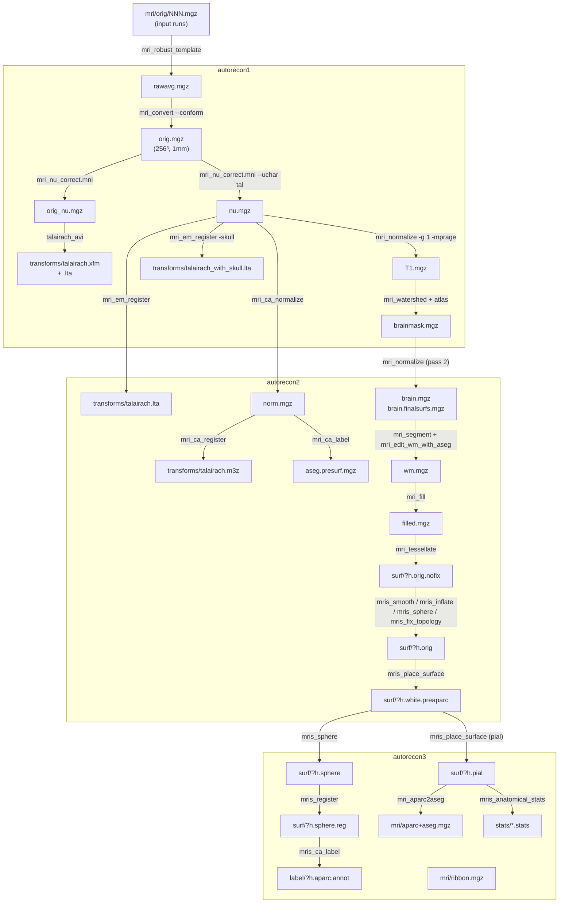

# recon-all

## Overview

`recon-all` is the master cortical reconstruction pipeline of FreeSurfer.
Given one or more T1-weighted MRI volumes of a subject, it produces a
complete set of anatomical derivatives: an intensity-normalised volume,
a subcortical segmentation ("aseg"), white and pial cortical surfaces
for each hemisphere, spherical registration to a group atlas, cortical
parcellations (Desikan–Killiany, Destrieux, DKT), and tabulated
per-region morphometric statistics. Conceptually it glues together
roughly three dozen FreeSurfer binaries, enforces their input/output
contracts, and imposes a fixed processing order.

Physically it is a large tcsh script at
`scripts/recon-all` (10128 lines in FreeSurfer 8.2.0). Each
*processing directive* on the command line — `-all`, `-autorecon1`,
`-autorecon2`, `-autorecon3`, or any individual `-<stage>` flag — sets
a corresponding `Do<Stage>` variable; the body of the script then walks
through every stage and runs each block whose `Do<Stage>` flag is 1.
The entire command line is echoed to `scripts/recon-all.cmd`; stdout/stderr
are teed into `scripts/recon-all.log`; and the status line for each stage
is written to `scripts/recon-all-status.log`.

> [!internal] Source entry points
> Stage dispatch flags are declared at
> `scripts/recon-all:322–391`. The `-all`, `-autorecon1`, `-autorecon2`
> and `-autorecon3` case statements are at
> `scripts/recon-all:7198–7465`. The canonical numbered stage listing
> printed by `-help` is at `scripts/recon-all:8839–8877`.

## Prerequisites

- **Environment:** `$FREESURFER_HOME` must be sourced
  (`source $FREESURFER_HOME/SetUpFreeSurfer.sh`), which provides
  `FREESURFER_HOME`, `SUBJECTS_DIR`, and adds `$FREESURFER_HOME/bin`
  to `PATH`. A valid license file is required.
- **Input data:** one or more T1-weighted volumes per subject. Multiple
  contrasts (T2, FLAIR) are optional. Any format readable by
  [[mri_convert]] is accepted (DICOM, NIfTI, MGH/MGZ, ANALYZE, …).
- **Assumptions on T1:** approximately 1 mm isotropic resolution, FOV
  ≤ 256 mm in each dimension. Non-isotropic data is silently conformed
  (see `-conform` / `-cm` gotchas below). Non-standard contrasts may
  require the `-mprage` / `-washu_mprage` flags.
- **Shell:** `/bin/tcsh -f`. The script contains guards against known
  bugs in tcsh 6.17.06.
- **Binaries:** every tool listed in `tools_involved:` above must be
  on `PATH`; the default install at `$FREESURFER_HOME/bin/` satisfies
  this.

## Directive-to-Stage Map

The three umbrella directives decompose into the following `Do<Stage>`
flags (from `scripts/recon-all:7198–7465`). A blank cell means the flag
is left at its default (0 unless otherwise set earlier in the script).

| Stage variable           | `-all`/`-autorecon-all` | `-autorecon1` | `-autorecon2` | `-autorecon3` |
|--------------------------|:--:|:--:|:--:|:--:|
| `DoMotionCor`            | ✓  | ✓  |    |    |
| `DoTalairach`            | ✓  | ✓  |    |    |
| `DoTalCheck`             | ✓  | ✓  |    |    |
| `DoNuIntensityCor`       | ✓  | ✓  |    |    |
| `DoNormalization`        | ✓  | ✓  |    |    |
| `DoSkullStrip`           | ✓  | ✓  |    |    |
| `DoGCAReg`               | ✓  |    | ✓  |    |
| `DoCANormalize`          | ✓  |    | ✓  |    |
| `DoCAReg`                | ✓  |    | ✓  |    |
| `DoCALabel`              | ✓  |    | ✓  |    |
| `DoNormalization2`       | ✓  |    | ✓  |    |
| `DoMaskBFS`              | ✓  |    | ✓  |    |
| `DoSegmentation`         | ✓  |    | ✓  |    |
| `DoFill`                 | ✓  |    | ✓  |    |
| `DoTessellate`           | ✓  |    | ✓  |    |
| `DoSmooth1`, `DoInflate1`| ✓  |    | ✓  |    |
| `DoQSphere`, `DoFix`     | ✓  |    | ✓  |    |
| `DoAutoDetGWStats`, `DoWhitePreAparc`, `DoCortexLabel` | ✓ | | ✓ | |
| `DoSmooth2`, `DoInflate2`, `DoCurvHK` | ✓ | | ✓ | |
| `DoSphere`, `DoSurfReg`, `DoJacobianWhite` | ✓ | | | ✓ |
| `DoAvgCurv`              | ✓  |    |    | ✓  |
| `DoCortParc`, `DoCortParc2`, `DoCortParc3` | ✓ | | | ✓ |
| `DoWhiteSurfs`, `DoPialSurfs` | ✓  |    |    | ✓  |
| `DoCurvStats`            | ✓  |    |    | ✓  |
| `DoCortRibbonVolMask`    | ✓  |    |    | ✓  |
| `DoParcStats`, `DoParcStats2`, `DoParcStats3` | ✓ | | | ✓ |
| `DoPctSurfCon`           | ✓  |    |    | ✓  |
| `DoRelabelHypos`         | ✓  |    |    | ✓  |
| `DoAParc2ASeg`, `DoAPas2ASeg` | ✓ | | | ✓ |
| `DoSegStats`             | ✓  |    |    | ✓  |
| `DoWMParc`               | ✓  |    |    | ✓  |
| `DoBaLabels`             | ✓  |    |    | ✓  |

> [!gotcha] Help-text stage numbering vs. code order
> The `-help` output (lines 8839–8877) lists stage 2 as *"NU (Non-Uniform
> intensity normalization)"* and stage 3 as *"Talairach transform
> computation"*. In the actual code, the `DoTalairach` block (lines
> 1738–2019) runs first and itself calls `mri_nu_correct.mni` *twice*:
> once as pre-processing for `talairach_avi` (producing `orig_nu.mgz`,
> no `--uchar`) and a second pass under `DoNuIntensityCor` (lines
> 2047–2104) that uses the now-existing `talairach.xfm` with `--uchar`
> to produce `nu.mgz`. The numbered help description is a conceptual
> summary; the code order is Motion → Talairach (with internal nu) →
> Nu (with uchar) → Norm1 → SkullStrip.

## Processing Stages

The stages below are grouped by directive. For each stage we give the
exact command line assembled by `recon-all` (with script variables
resolved to their typical default values for the `-all` directive on a
cross-sectional 1.5 T 1 mm T1). Optional branches are noted.

### autorecon1

The "volume preparation" directive. Turns one or more raw T1 volumes
into a bias-corrected, skull-stripped, 256³ 1 mm isotropic brain volume
that is the input for every subsequent stage.

#### Stage 1 — Motion Correction and Conform (`DoMotionCor`)

**Source lines:** `scripts/recon-all:1366–1593`.

Inputs: one or more `$SUBJECTS_DIR/<subj>/mri/orig/0NN.mgz` volumes.

1. **Input conversion** (only if `-i <vol>` was given): one
   [[mri_convert]] call per input:
   ```bash
   mri_convert <input> $SUBJECTS_DIR/<subj>/mri/orig/0NN.mgz
   ```
2. **Motion correction** (if >1 run): by default uses
   [[mri_robust_template]]:
   ```bash
   mri_robust_template \
       --mov <orig/001.mgz> <orig/002.mgz> ... \
       --average 1 \
       --template $SUBJECTS_DIR/<subj>/mri/rawavg.mgz \
       --satit --inittp 1 --fixtp --noit --iscale \
       --iscaleout <runN-iscale.txt> ... \
       --subsample 200 \
       --lta <orig/001.lta> <orig/002.lta> ...
   ```
   With `-nomcfsl 0` (legacy), `mri_motion_correct.fsl -o rawavg.mgz
   -wild 0NN.mgz` is used instead. If exactly one run is found, the
   script `cp`s it to `rawavg.mgz` with no registration.
3. **Conform to COR FOV 256³ 1 mm**:
   ```bash
   mri_convert rawavg.mgz orig.mgz --conform
   ```
   With `-cm` / `ConformMin`, `--conform_min` is used instead (for
   hi-res data). With `-cw256` or when `tmp/cw256` exists (the default
   when FOV > 256), `--cw256` is appended.
4. **Placeholder Talairach stamp**: even before the actual Talairach
   stage runs, the script writes a non-existent transform path into
   the header to avoid later time-stamp races:
   ```bash
   mri_add_xform_to_header -c transforms/talairach.xfm orig.mgz orig.mgz
   ```
5. **rawavg → orig LTA for provenance**:
   ```bash
   lta_convert --inlta identity.nofile --src rawavg.mgz \
       --trg orig.mgz --outlta transforms/rawavg2orig.lta \
       --subject <subj>
   ```
6. **Optional SynthStrip short-circuit**: if the environment enables
   `$SynthStrip`, the script runs [[mri_synthstrip]] here
   (`mri_synthstrip --threads $OMP_NUM_THREADS -i orig.mgz -o synthstrip.mgz`)
   and later bypasses `mri_watershed`. See gotcha below.

Outputs: `mri/rawavg.mgz`, `mri/orig.mgz`, `mri/transforms/rawavg2orig.lta`.

> [!assumption] FOV must be ≤ 256 mm
> After Stage 1 the script probes `orig.mgz` with `mri_info | grep fov`.
> If the reported FOV exceeds 256 the script errors out with
> "ERROR! FOV=... > 256" and instructs the user to re-run with
> `-cw256`. (`scripts/recon-all:1581–1591`.)

#### Stage 2/3 — Talairach (`DoTalairach`)

**Source lines:** `scripts/recon-all:1738–2041`.

Conceptually "Stage 3" in the help text, but executed before the
standalone NU stage (see gotcha above).

1. **Pre-bias correction** of the full head for robustness of
   registration:
   ```bash
   mri_nu_correct.mni --no-rescale --i orig.mgz --o orig_nu.mgz \
       --n 1 --proto-iters 1000 --distance 50
   ```
   With `-3T`, `--proto-iters 1000 --distance 50` stays (the code
   preserves the same numbers at 1.5 T and 3 T in v8). With
   `-ants-n3` or `-ants-n4`, the ANTs N3/N4 wrappers replace the MINC
   `nu_correct`. With `-nu-use-tal`, the already-bias-corrected
   `nu.mgz` is reused instead.
2. **Affine registration to MNI305** using Avi Snyder's 4dfp tools:
   ```bash
   talairach_avi --i orig_nu.mgz --xfm transforms/talairach.auto.xfm
   ```
   Optional flags:
   - `--atlas 3T18yoSchwartzReactN32_as_orig` (from `-schwartzya3t-atlas`)
   - `--atlas <user-name>` (from `-custom-tal-atlas <name>`)
   The script falls back to MINC's `talairach` (`talairach --i ... --xfm ...`)
   when `-use-mritotal` is passed, and to `run_samseg --reg-only` when
   `-samseg-reg` is passed.
3. **Install transform**: unless the user has already edited
   `talairach.xfm`, the script `cp`s `talairach.auto.xfm` to
   `talairach.xfm`. A pre-existing `talairach.xfm` is only overwritten
   when `-clean-tal` is specified.
4. **Convert to LTA** (only for downstream tools that want an LTA):
   ```bash
   lta_convert --src orig.mgz \
       --trg $FREESURFER_HOME/average/mni305.cor.mgz \
       --inxfm transforms/talairach.xfm \
       --outlta transforms/talairach.xfm.lta \
       --subject fsaverage --ltavox2vox
   ```
5. **Optional QA** (`DoTalCheck`): runs `talairach_afd -T 0.005 -xfm
   transforms/talairach.xfm` and Avi's z-score check against the
   Buckner-40 reference (mean 0.9781, std 0.0044). A `z < −9`
   triggers an automatic retry using the 3T atlas, then a fallback to
   MINC `mritotal`, then error exit.

Outputs: `mri/orig_nu.mgz`, `mri/transforms/talairach.auto.xfm`,
`mri/transforms/talairach.xfm`, `mri/transforms/talairach.xfm.lta`.

> [!gotcha] `-clean-tal` vs. preserving edits
> `talairach.xfm` is the file a user is expected to manually edit when
> QA fails. Because of this, `recon-all` will *not* overwrite an
> existing `talairach.xfm` even when re-running `-autorecon1` — unless
> the user also passes `-clean-tal`. Silent preservation of manual
> edits is the intended behaviour.

#### Stage 2 — NU Intensity Correction (`DoNuIntensityCor`)

**Source lines:** `scripts/recon-all:2047–2104`.

```bash
mri_nu_correct.mni --i orig.mgz --o nu.mgz \
    --uchar transforms/talairach.xfm \
    --n 2
```

- `--n 2` is the default number of N3 iterations (controlled by
  `-nuiterations`; the 3T defaults to `--n 1 --proto-iters 1000
  --distance 50`).
- `--uchar transforms/talairach.xfm` triggers `mri_make_uchar`, which
  uses the (now-existing) Talairach transform to locate a "ball of
  mostly-brain voxels", finds the WM peak of its intensity histogram,
  and rescales the volume so the peak lands at intensity ~110 (an
  `uint8` histogram-centring step). This compensates for histograms
  distorted by extracranial voxels.
- `--cm` is appended for hi-res (`ConformMin`) data.
- `-ants-n3` / `-ants-n4` replace the MINC backend with the ANTs N3/N4
  wrappers (and ignore the `--n`/`--proto-iters`/`--distance` flags).
- Finally the script stamps `transforms/talairach.xfm` into the header
  of `nu.mgz` with `mri_add_xform_to_header -c`.

Outputs: `mri/nu.mgz` (with Talairach transform in header).

> [!gotcha] The "hidden" first mri_nu_correct.mni
> `mri_nu_correct.mni` is actually called *twice* during autorecon1:
> once inside the `talairach:` block with `--no-rescale` (producing
> `orig_nu.mgz` for registration only), and once here under
> `DoNuIntensityCor` with `--uchar` (producing `nu.mgz`, the
> bias-corrected + histogram-centred volume used everywhere
> downstream). A `-noskip-nuintensitycor` directive only suppresses
> the *second* call.

#### Stage 4 — Intensity Normalization 1 (`DoNormalization`)

**Source lines:** `scripts/recon-all:2120–2210`.

```bash
mri_normalize -g 1 -seed 1234 -mprage nu.mgz T1.mgz
```

Other flags that may be inserted:

- `-f <control.dat>` if the user supplied control points.
- `-n <NormIters>` to override 3-D normalisation iteration count
  (default is whatever `mri_normalize` hard-codes).
- `-b <below>` to change the "accept as WM" threshold in intensity
  units below the target.
- `-mprage` (on by default via `IsMPRAGE=1`) or `-washu_mprage`, for
  the corresponding scan protocols.
- `-noconform` when `ConformMin` is set (hi-res).
- `-W ctrl_vol.mgz bias_vol.mgz` when running as the longitudinal
  *base* subject, to write out the control-point volume and estimated
  bias field for reuse across time points.

Outputs: `mri/T1.mgz` (and, for the longitudinal base, `mri/ctrl_vol.mgz`,
`mri/bias_vol.mgz`).

#### Stage 5 — Skull Strip (`DoSkullStrip`)

**Source lines:** `scripts/recon-all:2286–2645`.

The behaviour depends on three switches:

- **`$SynthStrip`** (environment / `-use-synthstrip` / `-synthstrip`):
  if set, the precomputed `synthstrip.mgz` from Stage 1 is applied to
  `T1.mgz`:
  ```bash
  mri_mask T1.mgz synthstrip.mgz brainmask.mgz
  ```
  The classical `mri_watershed` block is skipped.
- **Custom mask** (`-xmask <file>`): the custom mask in
  `mri/orig/rawmask.mgz` is resampled to `orig.mgz` space with
  [[mri_vol2vol]] and applied via `mri_mask`.
- **Default (classical) path**:
  1. If `WSGcaAtlas=1` (the default) and
     `transforms/talairach_with_skull.lta` does not yet exist, run a
     skull-aware atlas registration:
     ```bash
     mri_em_register -skull nu.mgz \
         $FREESURFER_HOME/average/RB_all_withskull_<date>.gca \
         transforms/talairach_with_skull.lta
     ```
  2. Run the watershed:
     ```bash
     mri_watershed -T1 \
         -brain_atlas $FREESURFER_HOME/average/RB_all_withskull_<date>.gca \
         transforms/talairach_with_skull.lta \
         T1.mgz brainmask.auto.mgz
     ```
     Additional options are appended from the `WSLess` / `WSMore` /
     `WSAtlas` / `WSCopy` / `WSPctPreFlood` / `WSSeedPoint` flags, and
     the user can pass any extra options via the `mri_watershed` line
     of the expert options file. If `optimal_skullstrip_invol` exists,
     the script uses that volume (e.g. `orig.mgz`) instead of `T1.mgz`
     and post-masks with `mri_mask T1.mgz brainmask.auto.mgz
     brainmask.auto.mgz`.
  3. If `DoGcut=1`, additionally run `mri_gcut` to shave dura off the
     result.
  4. If `DoMultiStrip=1`, the script runs `mri_watershed` for each
     `(vol, preflood_height)` in the product `{orig,orig_nu,T1} ×
     {5,10,20,30}`, measures goodness of fit with `mri_log_likelihood
     -orig T1.mgz <bma> <gca> <skull_lta>`, and keeps the best.
- **Install mask**: unless `brainmask.mgz` already exists and
  `-clean-bm` was not specified, `cp brainmask.auto.mgz brainmask.mgz`.

Outputs: `mri/brainmask.auto.mgz`, `mri/brainmask.mgz` (and
`mri/transforms/talairach_with_skull.lta` when classical path is
used).

> [!gotcha] SynthStrip vs. watershed coexist in the same script
> In v8.2.0 the `-use-synthstrip` path short-circuits *both* the
> `mri_em_register` skull atlas step and the `mri_watershed` call, but
> the `talairach_with_skull.lta` file is *not* produced in that case.
> Tools that later expect this LTA (e.g. custom pipelines using
> `mri_ca_label` with a skull-preserving atlas) may error out. See
> [[mri_synthstrip]] for the full list of downstream consequences.

### autorecon2

The "volumetric+surface generation" directive. Produces the canonical
atlas-registered volumes (`norm.mgz`, `aseg.presurf.mgz`,
`brain.mgz`, `wm.mgz`, `filled.mgz`), the hemisphere masks, and the
initial white surfaces through the "pre-aparc" stage.

#### Stage 6 — EM Register (`DoGCAReg`)

**Source lines:** `scripts/recon-all:2655–2694`.

```bash
mri_em_register -uns 3 -mask brainmask.mgz \
    nu.mgz $FREESURFER_HOME/average/RB_all_<date>.gca \
    transforms/talairach.lta
```

- `-uns 3` ("unsearched" neighbourhood size) is the default.
- For a `-base` subject, `norm_template.mgz` is used as input instead
  of `nu.mgz` and the `-mask brainmask.mgz` form is preserved.
- For the longitudinal `-long` time-points the stage is skipped; the
  base subject's `talairach.lta` is copied in `rca-long-tp-init`.
- When `EMRegAseg=0`, `talairach.lta` is replaced by a symlink to
  `talairach.xfm.lta`.

Output: `mri/transforms/talairach.lta`.

#### Stage 7 — CA Normalize (`DoCANormalize`)

**Source lines:** `scripts/recon-all:2700–2749`.

```bash
mri_ca_normalize -c ctrl_pts.mgz -mask brainmask.mgz \
    nu.mgz $FREESURFER_HOME/average/RB_all_<date>.gca \
    transforms/talairach.lta norm.mgz
```

Outputs: `mri/norm.mgz`, `mri/ctrl_pts.mgz`.

#### Stage 8 — CA Register (`DoCAReg`)

**Source lines:** `scripts/recon-all:2756–2809`. The slowest stage
in `-all`.

```bash
mri_ca_register -nobigventricles -T transforms/talairach.lta \
    -align-after -mask brainmask.mgz \
    norm.mgz $FREESURFER_HOME/average/RB_all_<date>.gca \
    transforms/talairach.m3z
```

Flags may add `-bigventricles -smoothness 0.5`, `-uncompress`,
`-secondpassrenorm`, `-n <iters>`, `-tol <tol>`, or (longitudinal
only) `-levels 2 -A 1 -l <base talairach.m3z> identity.nofile`.

Output: `mri/transforms/talairach.m3z` (the non-linear warp to the
GCA atlas).

#### Stages 9, 10 — Remove Neck / Recompute with Skull

Only run when `-rmneck` / `-skull-lta` are explicitly requested
(default off). Call `mri_remove_neck` to produce
`mri/nu_noneck.mgz`, then `mri_em_register -skull` again to produce
`mri/transforms/talairach_with_skull_2.lta`.

#### Stage 11 — CA Label (`DoCALabel`)

**Source lines:** `scripts/recon-all:2904–3065`.

Produces `mri/aseg.auto_noCCseg.mgz` via `mri_ca_label`, with
`-align` by default. Post-processing includes corpus-callosum
segmentation (`mri_cc`), and edit merging (`mri_seg_diff` /
`mri_segment`) to propagate any user edits from a previous run.

Outputs: `mri/aseg.auto.mgz`, `mri/aseg.presurf.mgz`.

> [!gap] autorecon2 details beyond CA Label
> Stages 12 (Normalization 2 → `brain.mgz` / `brain.finalsurfs.mgz`),
> 13 (WM segmentation → `wm.mgz`), 14 (edit WM with aseg), 15 (fill →
> `filled.mgz`), 16–23 (per-hemi tessellation, smooth1, inflate1,
> qsphere, fix topology, white pre-aparc, smooth2, inflate2, curv-H/K)
> are captured only by their anchor line numbers below; each will get
> a full step-by-step write-up when the corresponding tool page is
> created.
> - Normalization 2: `scripts/recon-all:3116–3155`
> - Create BrainFinalSurfs: `scripts/recon-all:3156–3250`
> - WM Segmentation + Fill: `scripts/recon-all:3251–3711`
> - Fix Topology: `scripts/recon-all:3712–4073`
> - Curvature H/K: `scripts/recon-all:4074–4208`

### autorecon3

The "surface-based" directive. Produces the spherical mapping, atlas
registration, cortical parcellations, pial surfaces, ribbon masks, and
every downstream statistic.

> [!gap] autorecon3 stage-by-stage
> Only the stage heads and anchor line numbers are captured in this
> draft; the detailed command lines for each stage will be filled in
> as the tool pages are written.
> - Surface Registration: `scripts/recon-all:4209–4263`
> - Sphere Reg w/ Jacobian: `scripts/recon-all:4264–4300`
> - Average Curv: `scripts/recon-all:4301–4334`
> - Cortical Parcellation (DK): `scripts/recon-all:4335–4491`
> - T1 Pial Surfaces: `scripts/recon-all:4492–4557`
> - T2/FLAIR Pial Refinement: `scripts/recon-all:4558–4822`
> - Curvature Anatomical Stats: `scripts/recon-all:4823–4844`
> - Cortical Ribbon: `scripts/recon-all:4845–4872`
> - Cortparc2 (Destrieux): `scripts/recon-all:4873–4916`
> - Cortparc3 (DKT): `scripts/recon-all:4917–4960`
> - WM/GM Contrast (`pctsurfcon`): `scripts/recon-all:4961–4995`
> - Relabel Hypointensities: `scripts/recon-all:4996–5170`
> - Surface Anatomical Stats: `scripts/recon-all:5171–5213`
> - Surface Anatomical Stats 2/3: `scripts/recon-all:5214–5384`
> - Brodmann Area Labels: `scripts/recon-all:5385–5636`
> - Entorhinal Cortex Label: `scripts/recon-all:5637–5692`
> - Local Gyrification Index: `scripts/recon-all:5693–5851`
> - Vertex Match Check: `scripts/recon-all:5852–5992`

## Data Flow Diagram



## Configuration

### Controlling which stages run

| Directive              | Effect |
|------------------------|--------|
| `-all` / `-autorecon-all` | Run every stage listed in the table above. |
| `-autorecon1`          | Stages 1–5 only (Motion → Skull Strip). |
| `-autorecon2`          | Stages 6–23 (EM Register → Inflate2). |
| `-autorecon2-cp`       | 12–23 (restart from control-point-driven Norm2). |
| `-autorecon2-wm`       | 15–23 (restart from Fill after WM edits). |
| `-autorecon2-inflate1` | 6–18 (up to Inflate1). |
| `-autorecon2-perhemi`  | Tess → Ribbon per hemi only. |
| `-autorecon2-volonly`  | Stage 6–15 (volumetric half of autorecon2). |
| `-autorecon2-samseg`   | Replace stages 6–11 with SAMSEG, then run 12–23. |
| `-autorecon3`          | Stages 24–34. |
| `-autorecon3-T2pial` / `-T2pial-only` | Refine pial surface with T2 only. |

Individual `-<stage>` / `-no<stage>` flags (e.g. `-talairach`,
`-notalairach`, `-skullstrip`, etc.) override the directive-implied
values, but their order on the command line matters — later flags
win.

### Expert options file

Per-binary arbitrary flags can be injected via an expert options
file (`-expert <file>` / `$SUBJECTS_DIR/global-expert-options.txt`).
Each non-comment line is of the form `<binary_name> <extra flags>`
and is appended to the script's default command line for that
binary. The binaries that accept expert options are enumerated at
`scripts/recon-all:9460–9490`; they include every tool listed in
`tools_involved:` that is a user-facing binary.

### Other common flags

- `-subject <id>` / `-s <id>` — subject directory under `$SUBJECTS_DIR`.
- `-sd <dir>` — override `$SUBJECTS_DIR`.
- `-i <vol>` — add an input volume (repeatable).
- `-T2 <vol>` / `-FLAIR <vol>` — add a secondary contrast for pial
  surface refinement.
- `-xmask <vol>` — use a user-supplied brain mask instead of the
  automated skull strip.
- `-cm` / `-hires` — preserve (approximately) native voxel size by
  conforming to the minimum dimension rather than to 1 mm.
- `-cw256` — force `--cw256` in the `mri_convert` conform step.
- `-3T` — apply the 3-T N3 parameters (`--proto-iters 1000 --distance
  50` with `--n 1`) for both `mri_nu_correct.mni` calls.
- `-mprage` (default on) / `-washu_mprage` — protocol hints for
  `mri_normalize` and `mri_segment`.
- `-openmp <n>` / `-threads <n>` — thread count for OpenMP-enabled
  tools (`mri_em_register`, `mri_ca_register`, `mris_sphere`).
- `-clean-tal`, `-clean-bm`, `-clean-wm`, `-clean-aseg`, `-clean-cp`,
  `-superclean` — force-overwrite files the script would otherwise
  preserve to keep manual edits.
- `-dontrun` — echo every command but skip execution (dry run).

## Failure Modes and Recovery

- **FOV > 256 mm**: Stage 1 aborts with an explicit message
  requesting `-cw256`. Re-run with that flag.
- **Talairach QA failure**: Stage 3 auto-retries with the 3-T atlas,
  then falls back to MINC `mritotal`. If both fail, the user must
  either edit `talairach.xfm` by hand and re-run with `-notal-check`,
  or inspect and repair the input volume.
- **Watershed over-strips / under-strips**: add `-wsless` / `-wsmore`,
  set `-wspct <float>` explicitly, pick a different `-wsseed C R S`,
  or switch to `-use-synthstrip`.
- **Topology defects**: re-run `-autorecon2-wm` after editing
  `wm.mgz`.
- **Pial surface defects**: re-run `-autorecon-pial` after editing
  `brain.finalsurfs.mgz` or providing T2/FLAIR with `-T2pial` /
  `-FLAIRpial`.
- **Is-running lock**: `scripts/IsRunning.lh` / `.rh` is created at
  the start of each `recon-all` and removed on success. If a crash
  leaves stale locks, rerun with `-no-isrunning` (not
  `-no-isrunning` as the flag's name suggests — it *removes* the
  lock file rather than skipping the check).
- **Partial failure**: the status file
  `scripts/recon-all-status.log` records the stage at which a failure
  occurred; re-run with the smallest directive that includes that
  stage.

## Typical Runtime

Wall-clock times for a 1 mm isotropic T1 on a modern single-socket
workstation (8 cores, 32 GB RAM), single-threaded unless noted. These
are order-of-magnitude figures; actual times vary with data quality
and hardware.

| Directive          | Runtime |
|--------------------|---------|
| `-autorecon1`      | ~15 minutes |
| `-autorecon2`      | ~4 hours (dominated by `mri_ca_register`) |
| `-autorecon3`      | ~3 hours (two hemispheres) |
| `-all`             | ~7–9 hours end-to-end |

With `-openmp 4` on `mri_em_register`, `mri_ca_register`, and
`mris_sphere`, `-all` typically drops to ~5 hours.

> [!gap] Empirical timings for v8.2.0
> The figures above are representative from published literature on
> prior FreeSurfer versions; v8.2.0 has not been independently
> benchmarked in this wiki. Needs verification against the FreeSurfer
> release notes.

## Gotchas

> [!gotcha] `-autorecon1` includes both `mri_nu_correct.mni` calls
> Users occasionally assume that `-nonuintensitycor` disables all
> non-uniformity correction in autorecon1. It does not: only the
> second pass (creating `nu.mgz`) is skipped; the first pass that
> creates `orig_nu.mgz` for Talairach registration still runs. To
> fully disable N3, disable Talairach as well with `-notalairach`.

> [!gotcha] `brainmask.mgz` is preserved across re-runs
> After the first successful skull strip, `brainmask.mgz` is only
> regenerated when `-clean-bm` is passed. The same holds for
> `talairach.xfm` (`-clean-tal`), `wm.mgz` (`-clean-wm`),
> `aseg.auto.mgz` (`-clean-aseg`), and user control-point files
> (`-clean-cp`). This is deliberately non-destructive behaviour, not
> a bug.

> [!gotcha] The `DoTalairach` block silently runs
> `mri_nu_correct.mni`
> A user who wants to skip NU correction entirely cannot do so by
> passing `-noskip-nuintensitycor` or by omitting `-nuintensitycor`,
> because the first pass of `mri_nu_correct.mni` is nested inside
> `DoTalairach` and is only controlled by `-notalairach`. See the
> gotcha note on "Help-text stage numbering" above.

> [!gotcha] SynthStrip → no `talairach_with_skull.lta`
> With `-use-synthstrip`, `mri_em_register -skull` is not called;
> this leaves downstream tools that expect
> `transforms/talairach_with_skull.lta` without their input. See
> [[mri_synthstrip]] for the full list.

## Related Pipelines

- [[infant-recon-all]] — pediatric pipeline for ages 0–4.5 years

## References

- Source: `$FREESURFER_SOURCE/scripts/recon-all` (10128 lines, v8.2.0)
- FreeSurfer wiki: <https://surfer.nmr.mgh.harvard.edu/fswiki/recon-all>
  (accessed 2026-04-14)
- FreeSurfer wiki, stages listing:
  <https://surfer.nmr.mgh.harvard.edu/fswiki/ReconAllTableStableV6.0>
  (the stage table is version 6.0-specific but structurally close to
  v8.2.0)
- Fischl, B. *FreeSurfer*. NeuroImage 62(2):774–781, 2012.
- Dale, A. M. & Sereno, M. I. *Improved localization of cortical
  activity by combining EEG and MEG with MRI cortical surface
  reconstruction: a linear approach*. J. Cogn. Neurosci. 5:162–176,
  1993.
- Reuter, M., Rosas, H. D. & Fischl, B. *Highly accurate inverse
  consistent registration: a robust approach*. NeuroImage 53:1181–1196,
  2010. (the `mri_robust_template` motion correction)
